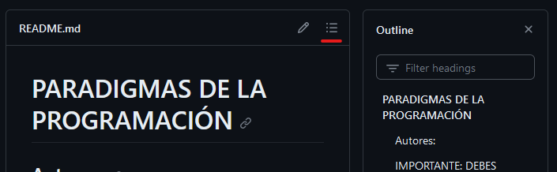
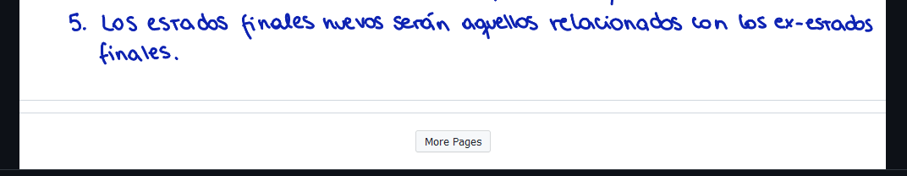
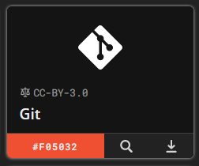

# :page_facing_up: papeos-guias :pencil2:

El propósito de este repo es alojar aportes voluntarios de alumnos que quieran compartir sus conocimientos sobre los ramos de la carrera, si estás buscando material sobre un curso y no puedes encontrar en ninguna parte, significa que alguien con los conocimientos y habilidades para hacerlo, debe hacerlo. 

Detente a considerar si esa persona eres tú. **Este proyecto depende totalmente de la voluntad de pocos para mejorar la calidad de la educación de todos.** [COMO APORTAR](#tengo-un-aporte-y-quiero-subirlo-)

- [¿Cuál es la diferencia entre una `Guía` y un `Resumen`?](#cuál-es-la-diferencia-entre-una-guía-y-un-resumen)
- [¿Porqué preferimos `markdown` y no `PDFs`?](#porqué-preferimos-markdown-y-no-pdfs)
- [Imágenes usachin](#imágenes-usachin)
- [Tengo un aporte y quiero subirlo ](#tengo-un-aporte-y-quiero-subirlo-)
  - [1. Fork + Pull request](#1-fork--pull-request)
  - [2. Enviar aporte por forms](#2-enviar-aporte-por-forms)
  - [3. Enviar aporte por correo](#3-enviar-aporte-por-correo)
  - [4. Únete a OsUsach](#4-únete-a-osusach)
- [Cómo leer](#cómo-leer)
  - [Índices](#índices)
  - [PDFs grandes](#pdfs-grandes)
- [Links originales](#links-originales)
- [Sources](#sources)
  - [Como agregar más iconos:](#como-agregar-más-iconos)

## ¿Cuál es la diferencia entre una `Guía` y un `Resumen`?

Un resumen debería ser el contenido del curso presentado en un formato breve.

Una guía debería contener la información sobre el curso que **no** se enseña en el curso. Mañas de los profesores, conocimientos previos o suplementarios, recomendaciones y otras cosas que anteriormente solo se decían de boca a boca.

## ¿Porqué preferimos `markdown` y no `PDFs`?

La razón más práctica es el peso del pdf, es que al clonar el repositorio se descargan todos los archivos. Al momento de comenzar este proyecto subimos 12 PDFs y cada pull tardó entre *1 y 2 minutos*.

La razón correcta es que [el texto plano es simplemente superior](https://www.youtube.com/watch?v=WgV6M1LyfNY), carga más rápido, es mucho más ligero, es legible sin renderizar y es fácil de modificar.

## Imágenes usachin

Sacamos las imágenes de este repo, ahora se encuentran aquí:

 [Artwork Usachin](https://github.com/open-source-usach/artwork-usachin)

## Tengo un aporte y quiero subirlo 

### 1. Fork + Pull request

Como dice arriba. 

Considera forkear la branch `folders`, tiene sólo las carpetas de cada carrera, sin archivos.

### 2. Enviar aporte por forms
https://forms.gle/cMbieLxsiR8cZhJJ6

### 3. Enviar aporte por correo
Envía tu aporte a ignacio.lara.v@usach.cl y lucas.mesias@usach.cl, incluye en el asunto `papeos-guias`

### 4. Únete a OsUsach
Los miembros de OsUsach pueden pushear al repositorio libremente.

Contáctanos:
| |nombre|correo | discord |
| - | - | - | - |
|</img> |[Ignacio Lara](https://github.com/kappita) | ignacio.lara.v@usach.cl |  lgnacio |
|</img> |[Lucas Mesias](https://github.com/Skyrdow) | lucas.mesias@usach.cl |  skyrdow |

## Cómo leer
Las guías del repositorio se encuentran en archivos markdown (.md), solamente los README.md se "abren" automáticamente, el resto debes abrirlos tú

### Índices
Cada .md tiene un índice con links a los cabezales del archivo

### PDFs grandes
Los PDFs más extensos tienen un botón para mostrár más páginas que en algunos casos es difícil de ver

## Links originales

 git original: [paradigmas-de-la-programacion](https://github.com/vastien/paradigmas-de-la-programacion)

## Sources
Las carpetas [sources](./sources/) se usan para guardar imágenes que luego se importan en los archivos markdown (.md)
### Como agregar más iconos:

- ir a https://simpleicons.org/
- descargar el .svg, dejarlo en la carpeta sources correspondiente
- agregar los atributos `width="16" fill="{color}"`
- cambiar el ancho (o alto con height), 16 encaja con el tamaño de texto por defecto
- copiar el color correspondiente al ícono y ponerlo en fill
- agregar el icono a tu .md:
    - ``
    - ``
    - 
