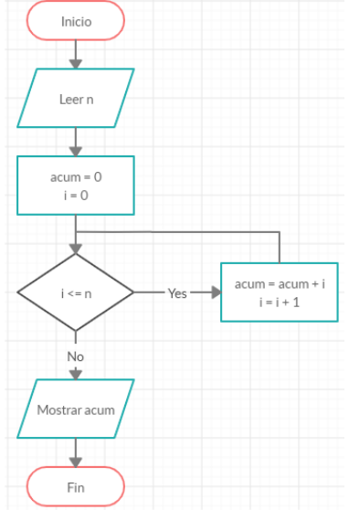
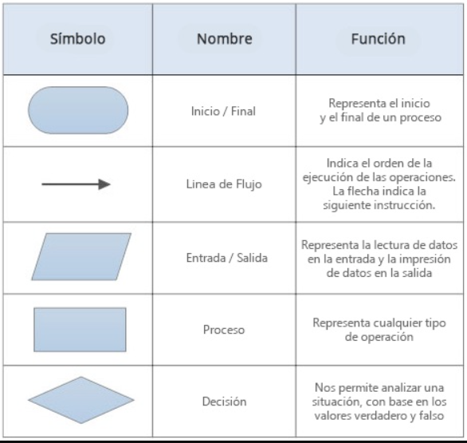
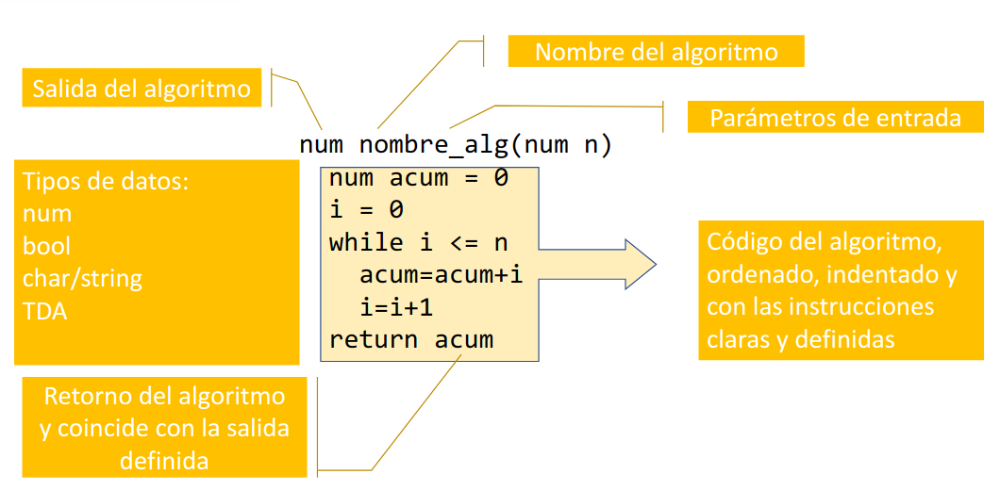

# Algoritmos

El concepto de algoritmo es algo mucho más sencillo de lo que parece, es algo que aplicamos todos los días para realizar las actividades diarias.

Un algoritmo, en términos naturales, es un conjunto de pasos ordenados y bien definidos para realizar una actividad o lograr algo, y esta actividad tiene un resultado. Por ejemplo, para servir un vaso de jugo, un algoritmo válido sería:

Objetivo: Servir juguito
1. Sacar el jugo del refrigerador
1. Sacar un vaso
1. Servir jugo en el vaso

Resultado: Un vaso de jugo

Los algoritmos planteados pueden ser tan sencillos o complejos como deseemos, aunque como somos informáticos, nuestro rol casi siempre será el convertir el algoritmo en las piezas más atómicas posibles, para que luego sea posible llevarlas a código.

Para ejemplificar, hagamos el mismo algoritmo de forma más específica

Objetivo: Servir juguito
1. Ir a la cocina
1. Abrir el refrigerador
1. Buscar la botella/caja de jugo
1. Sacar la botella/caja de jugo del refrigerador
1. Abrir la repisa
1. Buscar un vaso
1. Sacar el vaso de la repisa
1. Dejarlo en la mesa
1. Abrir el envase del jugo
1. Verter el jugo en el vaso hasta que se llene

Resultado: Un vaso de jugo

Ahora, cuando hablamos de algoritmos computacionales, esta misma definición se vuelve un poco más estricta. Estos algoritmos deben ser mucho más específicos y deben ser libres de errores. Sólo hay que pensar en los efectos que podría tener un programa que funciona mal. En el ejemplo anterior, si no definimos que se debe servir en el vaso, podríamos ensuciar toda la cocina. Si un algoritmo para calcular los materiales necesarios para construir un edificio falla, podría impedir la construcción o incluso, derrumbarse durante o después de la construcción.

Finalmente, lo último que queda para decir sobre los algoritmos es que son la base de la programación. Sin algoritmos, lo único que podríamos programar serían calculadoras.

# Formas de escribir algoritmos

Existen dos formas principales de escribir algoritmos (Antes de pasarlos directamente a código): Los diagramas de flujo y el pseudocódigo. Su principal objetivo y gracia es que son una forma más sencilla de representar un algoritmo, de una manera en la que incluso personas no muy conocidas en la computación puedan entenderlas. Esta facilidad no sólo se aplica a los externos, sino que a ustedes también les puede ser más fácil de escribir y entender un algoritmo de esta manera. Muchas veces será más útil comenzar con el pseudocódigo o diagrama, y después intentar pasarlo a un lenguaje de programación, ya que poseen un lenguaje más universal y sin las distintas mañas y particularidades de un lenguaje específico.

### Diagramas de flujo

Los diagramas de flujo son, como su nombre indica, diagramas. Son una forma muy gráfica de observar un algoritmo, pues sólo es necesario seguir el flujo para comprender qué se realiza. 

Es, probablemente, la forma más natural de mostrar un algoritmo, y es importante mencionar también que no es obligatorio que las partes del diagrama posean código, también pueden ser instrucciones naturales, como las que se veían en el ejemplo de servir jugo.

También es muy importante respetar la forma de cada elemento del diagrama. Personalmente creo que es redundante, sin embargo en caso de no seguir los lineamientos, dejamos de tener un diagrama de flujo y pasamos a tener simplemente un diagrama. Cada figura (Cuadrado, rombo, romboide y elipse) tiene una función específica e implica un comportamiento dentro del diagrama. La siguiente tabla los explica 

### Pseudocódigo

El pseudocódigo por otro lado, es mucho más parecido a lo que ya deberían haber visto, Python. Realmente, entre todas las personas con las que he conversado respecto a su opinión del pseudocódigo, es que es Python escrito en papel. De todas formas, tener esa experiencia nos ayuda aprender más rápido cómo escribirlo, y también a pensar maś rápido en cómo transcribir un algoritmo a pseudocódigo.

A lo largo de la carrera verán varias formas de escribir pseudo, sin embargo la forma que utilizan en EDA es idéntica a Python, sólo que se deben especificar el tipo de dato de entrada y de salida. El ejemplo que dejan en las diapositivas es bastante bueno.

Es vital tener cuidado siempre de respetar la identación correctamente, pues es la única forma de saber a qué está asociada cada instrucción.

