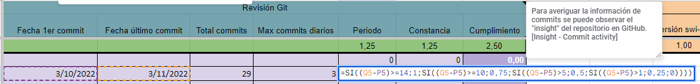
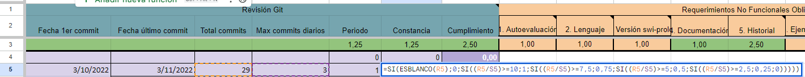
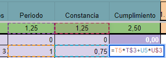
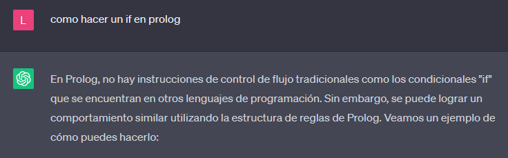

<h1 style="text-align:center">Como pasar Paradigmas de Programación</h1>


</img> [Lucas Mesías](https://github.com/Skyrdow)
## Introducción
Esto NO es una guía de scheme, prolog o java, porque los profes pueden simplemente cambiar los paradigmas del laboratorio, pero aún más importante que eso, es porque el foco del ramo es que aprendas a programar. Si el ramo realmente fuera de paradigmas, pasarían 9 o 10 diferentes, las peps serían de varios paradigmas a la vez, y los laboratorios serían más cortos.
El laboratorio es la parte más importante y que se debe llevar toda tu atención, las peps son ejercicios que ya deberías dominar si realmente hiciste bien el laboratorio respectivo.

## Antes de comenzar el laboratorio
### Con qué profesor tomar el ramo
No importa realmente, el profesor que escojas no va a determinar si pasas el ramo o no, depende de **ti**.
Igual recomiendo a Roberto Gonzalez, sabe más.

### Ignorar los comodines
Hacer el laboratorio como si no existieran los comodines, o al menos asumiendo que no los vas a necesitar, es importante. He visto que muchas personas se ponen las pilas en las últimas semanas del semestre, haciendo todos los comodines a la vez, preguntando en el grupo de whatsapp las cosas que todos nos estábamos preguntando la primera semana que se liberó el enunciado, si lo haces a tiempo, podrás hablar con tus compañeros las dudas que todos tienen al inicio, detalles pequeños o errores comunes que se van encontrando.

### Leer el enunciado
Es importante leer bien el enunciado completo antes de comenzar, entender qué es lo que hay que hacer, reconocer hasta qué punto necesitas como mínimo para tener el 4 y reconocer las funciones más difíciles. De esta forma cuando estés aprendiendo el lenguaje específico, podrás comenzar a plantear en tu cabeza algunas funciones, estructuras de datos, y usos para las metodologías específicas del paradigma, etc.

### Aprender a aprender a programar
Para hacer el laboratorio aprovechando todo el tiempo posible, debes aprender el lenguaje respectivo por tu cuenta, el profesor tardará varias semanas en pasar los conceptos básicos que realmente usarás en el proyecto, por eso debes buscar preferiblemente un tutorial en youtube, que enseña conceptos básicos del lenguaje y del paradigma de programación, luego en la clase, el profesor te enseñará de nuevo estos conceptos y rellenará detalles que no viste o que pasaste por alto.

### Github
Aprende a crear repositorios, subir, modificar y eliminar archivos antes de comenzar.
Recomiendo tener 2 repositorios por proyecto, uno donde guardas tu progreso real del proyecto, y el que vas a entregar para que sea revisado, en el segundo vas subiendo tu progreso por partes, constantemente.
Puedes ver las fórmulas exactas de cómo se mide el puntaje de la sección de github en las notas de semestres anteriores, pero lo que importa es trabajar por más de 14 días, y no tener más de 1 commit al día. Si tienes que subir otro commit el mismo día, espera hasta mañana.





## Resolviendo el laboratorio

### Resolver problemas
Si tienes un problema, tu última respuesta debería ser preguntarlo por el grupo de whatsapp, porque eso significa que vas a esperar a que alguien más lo resuelva por tí.

Si llevas mucho tiempo en el mismo problema y no consigues resolverlo, puedes dejarlo hasta ahí, descansar unos minutos, distraerte y volver con la mente fresca, muchas veces volverás a trabajar y se te ocurrirá en el mismo momento.

Otro truco es explicar el problema y tu solución a otra persona (real o imaginaria), encontrarás el error mientras lo explicas, además, si no puedes ni explicar lo que estás haciendo, no estás entendiendo el problema, y si no lo entiendes no lo vas a poder resolver.

Si no sabes como hacer algo, debes buscarlo en Google o preguntarle a ChatGPT (va a googlear la respuesta y te la va a mostrar), si no encuentras una respuesta online, puedes preguntarle al profesor (es literalmente su trabajo) y por último a un compañero. Preguntarle al profesor antes que a un compañero es importante porque el profesor sabe más, usualmente te dirá la respuesta correcta, o te mostrará el error que cometiste y que no te deja llegar a la solución. Además, ellos van a revisar el laboratorio y si recuerdan tu nombre o dedicación, te evaluarán mejor.

Preguntas sacadas directamente del grupo de whatsapp:


### Usar google
Escribe la pregunta, no importa si no crees que tu problema es muy específico, encontrarás respuestas igualmente.
Si tu pregunta es muy específica, tienes que generalizar, no busques “como saco un producto de mi carrito en prolog”, busca “como saco un elemento de una lista en prolog”
Busca en inglés, hay más resultados. **Saber inglés es obligatorio para la carrera, estás estudiando informática.**

### Usar ChatGPT
Aprovecha que todavía no regulan el uso de ChatGPT en la universidad, si puedes evitarlo googleando, hazlo, al final la IA googleará por tí de todas formas.
Puede generar código, pero tienes que probarlo y asegurarte de que funciona, si le preguntas algo, compruébalo, dependiendo de la forma en la que le preguntes, puede mentir.
Puede comentar tu código, leelo y comprueba que sea correcto.
No usarlo para nada matemático, es terrible.
Recomiendo dar crédito a la ChatGPT en las partes que sea razonable hacerlo, de la misma forma que ya lo deberías hacer si sacas código de internet. Eventualmente los profesores harán algo para detectar o intentar detectar el uso de IAs, e informar su uso será obligatorio.

### Problemas específicos del paradigma
La idea de programar bajo un paradigma es seguir las normas del paradigma, por lo que en algún momento te encontrarás buscando como hacer un if en prolog o un for en scheme, cosa que no deberías hacer, ya que los distintos paradigmas tienen sus propios métodos de hacer las cosas, y los profesores buscan evaluar el uso correcto del mismo.

Si te encuentras en una situación en la que quieres implementar algo, y se complica demasiado, parece imposible, etc, probablemente debes pensar de nuevo la estructura de tu código y comenzar de nuevo, desde otro punto de vista. El laboratorio está pensado para poder resolverse, no para atormentar a la clase.

### Escribir código ordenado/código limpio
Esta parte es muy importante, más de lo que crees.
El proyecto está pensado para que uses un mes entero para resolverlo, puedes hacerlo entero si le dedicas 3 o 4 días completos, pero tomando en cuenta los otros ramos y cosas externas a la u, tienes que hacerlo a lo largo de 30 días, por lo que tu código debe ser ordenado, debe ser fácil de leer y comprender, porque no vas a recordar en el día 27 lo que hiciste en esa función el día 2, y si no la puedes entender ni tú, lo vas a terminar reescribiendo.

Existen muchas técnicas y varios libros sobre código limpio, pero para el ramo recomiendo:

#### Nombres descriptivos:
Un pequeño ejemplo que le pedí a mi ayudante muestra que el nombre de las variables le da contexto al problema, y te ayuda a visualizar mejor lo que está ocurriendo:
* Código con nombres no descriptivos:
```python
a = 5
h = 10
x = (a * h) / 2
print(x)
```
* Código con nombres descriptivos de variables:
```python
base = 5
altura = 10
area = (base * altura) / 2
print(area)
```
Más: [Naming Things in Code](https://www.youtube.com/watch?v=-J3wNP6u5YU)

#### Código duplicado:

Si estás repitiendo el mismo código, mismas líneas o mismas funciones, es signo de que necesitas crear una función nueva.
```python
usuario = input("Ingrese su nombre de usuario: ")
if len(usuario) < 5:
    print("El nombre de usuario debe tener al menos 5 caracteres.")
elif len(usuario) > 20:
    print("El nombre de usuario no puede exceder los 20 caracteres.")

contrasena = input("Ingrese su contraseña: ")
if len(contrasena) < 8:
    print("La contraseña debe tener al menos 8 caracteres.")
elif len(contrasena) > 16:
    print("La contraseña no puede exceder los 16 caracteres.")
```

* “En este caso, se están realizando las mismas validaciones de longitud tanto para el nombre de usuario como para la contraseña. Podemos eliminar el código duplicado creando una función genérica llamada `validar_longitud`:”
```python
def validar_longitud(cadena, minimo, maximo):
    if len(cadena) < minimo:
        print(f"La cadena debe tener al menos {minimo} caracteres.")
    elif len(cadena) > maximo:
        print(f"La cadena no puede exceder los {maximo} caracteres.")

usuario = input("Ingrese su nombre de usuario: ")
validar_longitud(usuario, 5, 20)

contrasena = input("Ingrese su contraseña: ")
validar_longitud(contrasena, 8, 16)
```
Por otro lado, imagina que escribiste el siguiente código:
```python
largo1, ancho1 = 5, 4
area1 = largo1 * ancho1

largo2, ancho2 = 6, 3
area2 = largo2 * ancho2

largo3, ancho3 = 8, 2
area3 = largo3 * ancho3
```
Si luego de que escribir todo, te diste cuenta de que usaste la fórmula equivocada, deberás ir a cada instancia, una por una haciendo los cambios, cuando podrías haber evitado todo el problema definiendo una pequeña función:
```python
def calcular_valor(largo, ancho):
    return largo * ancho
```
Luego, si es necesario cambiar el comportamiento, bastará con modificar la función y el resto del código seguirá funcionando.

En el ejemplo anterior hay 3 instancias del código, y todas están juntas en la misma zona, por lo que arreglar el error no parece muy complicado, pero cuando tengas un proyecto de múltiples archivos, donde cada uno tiene más de 300 líneas de largo, con múltiples instancias de código repetido por todos lados, va a ser un problema. Y si se te pasa por alto cambiar solo una instancia de este código repetido, tendrás un bug muy difícil de encontrar en tu proyecto.

El mismo concepto se puede aplicar para eliminar los ***números mágicos***, refiriendose simplemente a números sueltos en tu código.
```python
def validar_longitud(cadena):
    return len(cadena) < 20
```
Eliminar los números mágicos también aumenta la legibilidad del código, como ya expliqué en la [sección anterior](#nombres-descriptivos).
```python
LONGITUD_MAXIMA = 20
def validar_longitud(cadena):
    return len(cadena) < LONGITUD_MAXIMA
```

#### Funciones pequeñas: 
Las funciones no deberían de ser más grandes que el tamaño de la pantalla, puedes tomar el contenido de una función complicada y meterlo dentro de otra.
```python
def procesar_numeros(numeros):
    suma_total = 0
    producto_total = 1
    maximo = float('-inf')

    for num in numeros:
        suma_total += num
        producto_total *= num
        if num > maximo:
            maximo = num

    promedio = suma_total / len(numeros)
    resultados = {
        'suma': suma_total,
        'producto': producto_total,
        'maximo': maximo,
        'promedio': promedio
    }

    return resultados
```

“En este caso, la función `procesar_numeros` realiza múltiples operaciones en un solo bloque de código. Podemos descomponerla en funciones más pequeñas para mejorar la legibilidad y el mantenimiento del código. Aquí está el código refactorizado:”
```python
def calcular_suma(numeros):
    suma = 0
    for num in numeros:
        suma += num
    return suma

def calcular_producto(numeros):
    producto = 1
    for num in numeros:
        producto *= num
    return producto

def encontrar_maximo(numeros):
    maximo = float('-inf')
    for num in numeros:
        if num > maximo:
            maximo = num
    return maximo

def calcular_promedio(numeros):
    suma = calcular_suma(numeros)
    promedio = suma / len(numeros)
    return promedio

def procesar_numeros(numeros):
    suma = calcular_suma(numeros)
    producto = calcular_producto(numeros)
    maximo = encontrar_maximo(numeros)
    promedio = calcular_promedio(numeros)

    resultados = {
        'suma': suma,
        'producto': producto,
        'maximo': maximo,
        'minimo': minimo,
        'promedio': promedio
    }
    return resultados
```
El código completo se ve más grande, pero la función “procesar_numeros” es mucho más facil de leer.

***"An idiot admires complexity, a genius admires simplicity."*** -Terry A. Davis

## Nota final
Si sabes programar, el ramo no es difícil, con un poco de organización se pasa solo.
Me pareció importante compartir la información que sé porque la universidad no hace un buen trabajo en enseñarte a disfrutar la programación, tristemente es algo que tienes que aprender por tu cuenta.

## Otras recomendaciones
*  Usar [Visual Studio Code](https://code.visualstudio.com/)
*  Usar [GitKraken](https://www.gitkraken.com/)
* Aprender inglés, leer, escribir y escuchar, y acostumbrarse a programar en inglés.
* Usar linux, en máquina virtual, WSL, dual boot o en un pc antiguo.
* Aprender el formato de commits convencionales, útil para trabajar en grupo [Conventional Commit Messages](https://gist.github.com/qoomon/5dfcdf8eec66a051ecd85625518cfd13#examples)
* 2 monitores en el pc.

## Más
*  [CodeAesthetic](https://www.youtube.com/@CodeAesthetic)
* [Buenas prácticas C++](https://docs.google.com/document/d/1H1BXdbycwdnS-cJ1ONCT64W7am0vVtRJJUeFF7DcyTI/edit)
*  [C Programming Language - Intro to Computer Science - Harvard's CS50 (2018)](https://www.youtube.com/watch?v=ix5jPkxsr7M)
*  [Clean Code - Uncle Bob / Lesson 1](https://www.youtube.com/watch?v=7EmboKQH8lM)
*  [History's Worst Software Error](https://www.youtube.com/watch?v=Ap0orGCiou8)
*  [Fast Inverse Square Root — A Quake III Algorithm](https://www.youtube.com/watch?v=p8u_k2LIZyo)
*  [How I learned Unity without following tutorials (Developing 1)](https://www.youtube.com/watch?v=vFjXKOXdgGo)
*  [Four-Byte Burger](https://www.youtube.com/watch?v=i4EFkspO5p4)
* [TUNIC on Steam](https://store.steampowered.com/app/553420/TUNIC/)


