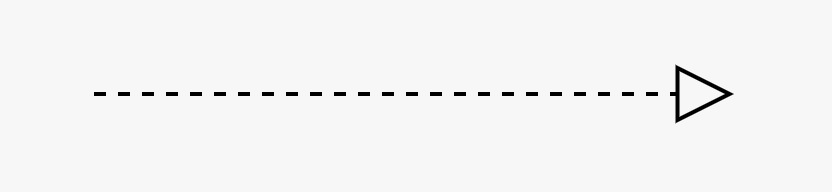
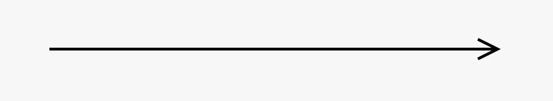
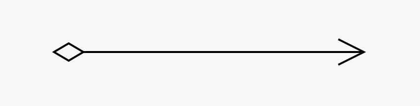
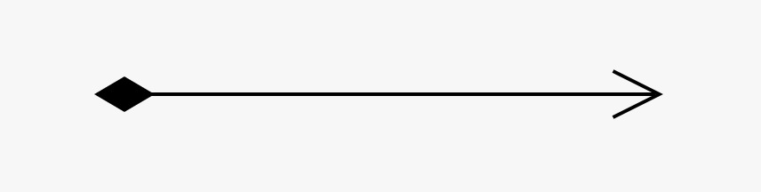
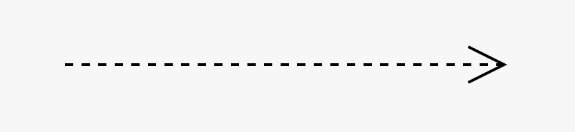
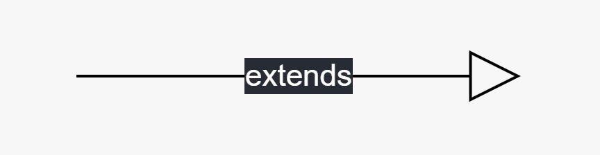
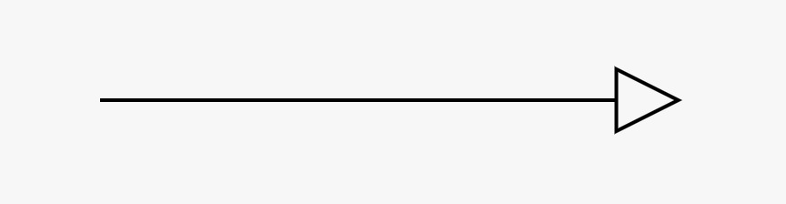

## Autor
-  </img> [Jorge Jimenez](https://github.com/shinkest)

## Descripción general
Dicho paradigma está basado en la existencia de **objetos**, los cuales pertenecen a una determinada categoría (**clase**), y que tienen asociados una serie de características (**atributos**) y de acciones (**métodos**) que permiten distinguirlos entre sí.

Por ejemplo: digamos que tenemos la clase *Mueble*, cuyos atributos son el *color* del mueble, y la cantidad de *"patas"* que tienen; mientras que sus atributos asociados son *mover()* y *usar.

Dentro de dicha clase pueden existir múltiples objetos que pertenezcan a ésta (bajo dicha concepción, un objeto se puede entender como <u>la instancia de una clase</u>), tales como un escritorio, una mesa, una silla, entre otros.

```java
public class Main{
	public static void main(String[] args){
		Mueble escritorio = new Mueble("cafe oscuro", 4);
		Mueble mesa = new Mueble("negro", 4);
		Mueble silla = new Mueble("rojo", 1);
		System.out.println("El color del escritorio es: " + escritorio.color);
		System.out.println("El color de la mesa es: " + mesa.color);
		System.out.println("El color de la silla es: " + silla.color);
		mesa.mover();
		silla.usar();
	}
}

public class Mueble{
	public String color;
	public int cantidadPatas;
	public Mueble(String color, int cantidadPatas){
		this.color = color;
		this.cantidadPatas = cantidadPatas;
	}
	public void mover(){
		System.out.println("Se ha movido el mueble.");
	}
	public void usar(){
		System.out.println("El mueble se esta utilizando.");
	}
}
```

Dos o más objetos se pueden comunicar entre sí mediante una propiedad llamada "<u>paso de mensajes</u>", en la que un objeto puede solicitar información a otro objeto, o bien que éste realice una acción en específico, al llamar a funciones de otras clases (inicializando objetos que pertenezcan a dichas clases primero). 

### Algunos conceptos importantes
* **Acoplamiento**: Se refiere al grado de dependencia entre dos objetos o funciones, tal que si dos objetos cuentan con un alto acoplamiento, resulta difícil trabajar sobre uno, sin afecta el comportamiento del otro.
* **Cohesión**: Se refiere al grado de responsabilidad con el que cuenta una clase, refiriéndose a "cuanto es lo que hace", en relación a lo solicitado.
+ **Responsabilidad** de un objeto: Se puede referir tanto al comportamiento (tareas que lleva a cabo), como a la información (datos o variables) que almacena.
+ **Rol** de un objeto: Colección o conjunto de responsabilidades.
+ **Colaboraciones** de un objeto: Se refiere a las interacciones que tiene con otros objetos.

## Relaciones
En relación al concepto de **colaboraciones**, dos (o más) objetos o clases pueden relacionarse entre sí de diferentes maneras; los principales ejemplos son:

* **Dependencia**: Se dice que una clase A depende de otra clase B cuando A instancia un objeto de dicha clase <u>en un momento en específico y de forma temporal</u>.

   Un ejemplo: dos clases A y B, independientes por su cuenta, tal que A hace uso de un objeto de B al llamarlo como parámetro para una función.

* **Asociación**: Se dice que una clase B está asociada a una clase A tal que, <u>en los atributos de A, se encuentra un objeto de B</u>; a lo anterior, se suma que si bien las clases **comparten los mismos ciclos de vida, no son relevantes** para su interacción.

   Un ejemplo: dos clases A y B, independientes por su cuenta, tal que uno de los atributos de A corresponde a un objeto (inicializado previamente fuera de A) de B.
   
* **Agregación**: Similar a asociación, con la diferencia que agregación suele asociarse a una relación más fuerte, y que las clases, a nivel de código, **son independientes** la una de la otra.

   Generalmente, suele evidenciarse mejor la diferencia entre las dos últimas relaciones mediante el modelamiento de **diagramas UML**.

* **Composición**: Se dice que una clase B se compone de una clase A cuando, si llegase a desaparecer A, <u>B también lo hace</u>.

A continuación, se adjuntan las flechas con las que dichas relaciones quedan representadas al momento de modelar **diagramas UML**.


| Nombre      | Flecha                             |
|:------------|:-----------------------------------|
| Dependencia |  |
| Asociación  |   |
| Agregación  |   |
| Composición |  |

Existen dos tipos principales de polimorfismo: el polimorfismo de **métodos** y el polimorfismo de **clases**.

### Polimorfismo de métodos
1. Polimorfismo en tiempo de métodos (sobrecarga de métodos): Ocurre cuando existen múltiples funciones con el mismo nombre, pero que cuentan con distintos argumentos (ya sea la cantidad, o el tipo de éstos)
2. Polimorfismo en tiempo de ejecución (sobreescritura de métodos): Ocurre cuando se sobrescribe la implementación de un método por una clase en específico, ya sea que dicho método sea proporcionado por una superclase (herencia), una interface, o por la misma clase.
     
     Una forma de distinguirlo en código es mediante el uso del operador <span class="yellow">@Overwrite</span>.

<div style="page-break-after: always;"></div>

### Polimorfismo de clases
1. **Herencia**: También conocida como "generalización", consiste en el paso de atributos y métodos de una clase (**superclase**) a otra(s) (**subclase**(**s**)), tal que esta(s) contenga(n) la misma información base de la clase padre, pudiendo incorporar otros atributos y métodos.

	Para ello, se utiliza la palabra reservada `extends` al momento de declarar a la clase hija.

2. **Interface**: Corresponde a una clase reservada, sobre la que se pueden declarar métodos, junto a su respectivo tipo de retorno y parámetros de entrada, sin dejar expresada su implementación (también conocidos como métodos abstractos) tal que, aquellas clases que hagan uso de dicha interface (mediante la palabra reservada `implements`), **si o si** deban contar con dichos métodos.

3. **Clase abstracta**: Corresponde a una combinación de las dos técnicas previas, en la que se define una clase que puede contener tanto métodos abstractos o no, los cuales son heredados e implementados por las subclases (utilizando `implements`) que los utilicen, según corresponda.

    Para declarar a dicha clase, como a los métodos abstractos, se antepone la palabra reservada (`abstract`).

A continuación, se adjuntan las flechas con las que dichas técnicas se representan en el modelamiento de **diagramas UML**.

| Nombre          | Flecha                                 |
|:----------------|:---------------------------------------|
| Herencia        |         |
| Interface       |        |
| Clase abstracta |  |  


  


