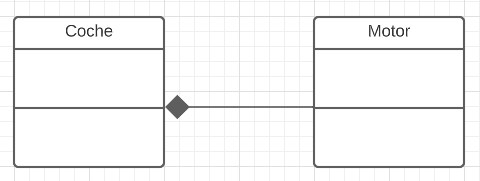
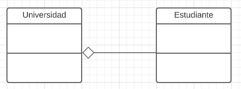
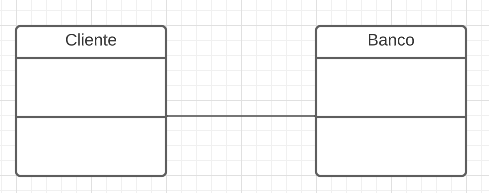
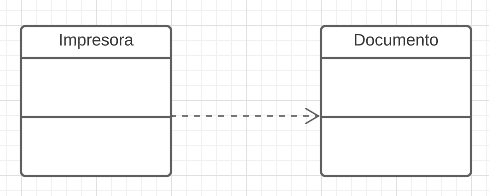

# PARADIGMA ORIENTADO A OBJETOS (POO)
El paradigma orientado a objetos es un modelo de programación que se basa en la creación de objetos, los cuales contienen datos y métodos que pueden interactuar entre sí. En este paradigma, se enfatiza la modularidad, la reutilización de código y la abstracción de datos.

## ¿Qué ventajas ofrece el paradigma orientado a objetos?
El paradigma orientado a objetos ofrece varias ventajas, como la modularidad, la reutilización de código, la abstracción de datos, la facilidad de mantenimiento y la escalabilidad. Al utilizar objetos, se pueden dividir los problemas en partes más pequeñas y manejables, lo que facilita el mantenimiento y la escalabilidad del programa. Además, el uso de clases y objetos permite la reutilización de código, lo que ahorra tiempo y recursos en el desarrollo de programas complejos.

## Conceptos del paradigma

### Objeto
Un objeto es una instancia de una clase, es decir, una entidad con atributos y comportamientos específicos. Por ejemplo, en un programa de gestión de biblioteca, un objeto podría ser un libro con atributos como título, autor y número de páginas, y métodos como prestar y devolver.

### Clase
Una clase es un modelo o plantilla para la creación de objetos. Define los atributos y métodos que tendrán los objetos que se creen a partir de ella. Por ejemplo, una clase "Libro" podría tener atributos como título, autor y número de páginas, y métodos como prestar y devolver.
````java
public Class Libro{
    // Atributos
    public String titulo;
    public Integer numeroPaginas;
    public String autor;

    // Métodos
    public void prestar(){ ... }
    public void devolver(){ ... }
}
````

### Herencia
La herencia es un mecanismo mediante el cual una clase puede heredar atributos y métodos de otra clase. La clase que hereda se conoce como subclase, y la clase de la cual se heredan los atributos y métodos se conoce como superclase. Por ejemplo, en un programa de gestión de biblioteca, una subclase de la clase "Libro" podría ser la clase "Libro de Texto", que hereda los atributos y métodos de la clase "Libro" y añade atributos y métodos propios.

```java
public class Mamifero {
	public String nombre;
	protected int edad;
	
	public void comer() { /* ... */ }
	public void desplazarse() { /* ... */ }
}

public class Jirafa extends Mamifero {
	public void comer() { /* ... */ }
	public void desplazarse() { /* ... */ }
}
```

### Polimorfismo
El polimorfismo es la capacidad de un objeto de una clase para comportarse como un objeto de otra clase. Esto se logra mediante la implementación de métodos con el mismo nombre en varias clases diferentes. Por ejemplo, en un programa de gestión de biblioteca, las clases "Libro" y "Revista" podrían tener un método "prestar", que aunque tienen la misma acción, pueden ser implementados de diferentes maneras.

```java
// Clase Animal
public class Animal {
    public void hacerSonido() {
        System.out.println("Un animal hace un sonido.");
    }
}

// Clase Perro que hereda de Animal
public class Perro extends Animal {
    public void hacerSonido() {
        System.out.println("El perro hace guau guau.");
    }
}

// Clase Gato que hereda de Animal
public class Gato extends Animal {
    public void hacerSonido() {
        System.out.println("El gato hace miau miau.");
    }
}

// Clase principal para probar el polimorfismo
public class TestPolimorfismo {
    public static void main(String[] args) {
        // Creamos un array de animales con diferentes tipos de animales
        Animal[] animales = new Animal[2];
        animales[0] = new Perro();
        animales[1] = new Gato();
        
        // Llamamos al método hacerSonido() de cada animal en el array
        for (Animal animal : animales) {
            animal.hacerSonido();
        }
    }
}

```

### Encapsulamiento
El encapsulamiento es un mecanismo mediante el cual se protege el acceso a los atributos y métodos de un objeto, limitando su visibilidad desde fuera de la clase. Esto se logra mediante el uso de modificadores de acceso como public, private y protected. Por ejemplo, en una clase "Libro", el atributo "número de páginas" podría ser privado para evitar que se modifique desde fuera de la clase.

```java
public class Persona {
    private String nombre;
    private int edad;
    private String direccion;
    
    public String getNombre() {
        return nombre;
    }
    
    public void setNombre(String nombre) {
        this.nombre = nombre;
    }
    
    public int getEdad() {
        return edad;
    }
    
    public void setEdad(int edad) {
        this.edad = edad;
    }
    
    public String getDireccion() {
        return direccion;
    }
    
    public void setDireccion(String direccion) {
        this.direccion = direccion;
    }
}
```

### Clase abstracta
En la programación orientada a objetos (POO), una clase abstracta es una clase que no se puede instanciar directamente, sino que se utiliza como base para crear otras clases. Una clase abstracta solo puede ser utilizada como una clase base para otras clases, y se define utilizando la palabra clave "abstract" en la declaración de clase.

Una clase abstracta puede contener métodos abstractos, que son métodos sin cuerpo o implementación, es decir, solo se declara la firma del método sin proporcionar su implementación. Estos métodos abstractos deben ser implementados por las clases derivadas que hereden de la clase abstracta. Las clases que heredan de una clase abstracta deben proporcionar una implementación para todos los métodos abstractos heredados.
```java
// Clase abstracta Figura
public abstract class Figura {
    // Método abstracto para calcular el área de la figura
    public abstract double area();
}

// Clase Triangulo que hereda de Figura
public class Triangulo extends Figura {
    private double base;
    private double altura;
    
    // Constructor de Triangulo
    public Triangulo(double base, double altura) {
        this.base = base;
        this.altura = altura;
    }
    
    // Implementación del método area para Triangulo
    public double area() {
        return (base * altura) / 2;
    }
}

// Clase Circulo que hereda de Figura
public class Circulo extends Figura {
    private double radio;
    
    // Constructor de Circulo
    public Circulo(double radio) {
        this.radio = radio;
    }
    
    // Implementación del método area para Circulo
    public double area() {
        return Math.PI * radio * radio;
    }
}

```

### Interfaces
En programación orientada a objetos, una interfaz es una colección de métodos abstractos (es decir, métodos que no tienen una implementación definida) y constantes. Las interfaces permiten definir un conjunto de comportamientos que una clase debe implementar, pero no proporcionan ninguna implementación real para esos comportamientos.

Las interfaces se utilizan para definir una especificación o contrato que una clase debe cumplir. Cuando una clase implementa una interfaz, debe proporcionar una implementación para todos los métodos definidos en esa interfaz.

Las interfaces son muy útiles porque permiten definir un comportamiento común que puede ser implementado por diferentes clases de manera diferente. Por ejemplo, una interfaz Movable puede ser implementada por una clase Car y una clase Bicycle, pero cada una de estas clases implementará los métodos de la interfaz de manera diferente.

```java
public interface Movable {
    public void moveForward();
    public void moveBackward();
}

public class Car implements Movable {
    public void moveForward() {
        System.out.println("Car moving forward");
    }
    
    public void moveBackward() {
        System.out.println("Car moving backward");
    }
}

public class Bicycle implements Movable {
    public void moveForward() {
        System.out.println("Bicycle moving forward");
    }
    
    public void moveBackward() {
        System.out.println("Bicycle moving backward");
    }
}
```


## Tipos de relaciones entre objetos/clases
Los objetos en este paradigma pueden interactuar entre sí, generando tipos de dependencia que veremos a continuación.

### Composición
La composición es una relación entre dos clases donde una clase es parte de la otra clase y no puede existir sin ella. La clase que contiene a la otra se conoce como la clase contenedora, mientras que la clase contenida se conoce como la clase contenida.

Un ejemplo de composición en Java podría ser una clase "Coche" que tiene un objeto de la clase "Motor". El motor es una parte esencial del coche y no puede existir sin él. Si se elimina el coche, el motor también se elimina.
```java
public class Motor {
    // Código del motor
}

public class Coche {
    private Motor motor;
    
    public Coche() {
        this.motor = new Motor();
    }
    
    // Resto del código del coche
}
```



### Agregación
La agregación es una relación entre dos clases donde una clase es parte de la otra clase, pero puede existir sin ella. La clase que contiene a la otra se conoce como la clase contenedora, mientras que la clase contenida se conoce como la clase contenida.

Un ejemplo de agregación en Java podría ser una clase "Universidad" que tiene un conjunto de objetos de la clase "Estudiante". Los estudiantes pueden existir sin la universidad y pueden ser parte de otras universidades o instituciones educativas.
```java
public class Estudiante {
    // Código del estudiante
}

public class Universidad {
    private ArrayList<Estudiante> estudiantes;
    
    public Universidad() {
        this.estudiantes = new ArrayList<Estudiante>();
    }
    
    // Resto del código de la universidad
}
```



### Asociación
La asociación es una relación entre dos clases donde una clase utiliza o referencia a la otra clase, pero no están relacionadas como partes de un todo. Ambas clases pueden existir de forma independiente.

Un ejemplo de asociación en Java podría ser una clase "Banco" que tiene un objeto de la clase "Cliente". El banco utiliza los datos del cliente para realizar operaciones, pero el cliente puede existir sin el banco y puede ser cliente de otros bancos.
```java
public class Cliente {
    // Código del cliente
}

public class Banco {
    private Cliente cliente;
    
    public Banco(Cliente cliente) {
        this.cliente = cliente;
    }
    
    // Resto del código del banco
}
```

### Dependencia
La dependencia es una relación entre dos clases donde una clase utiliza o referencia a la otra clase en una función o método. Si la clase referenciada cambia, la clase dependiente también puede verse afectada.

Un ejemplo de dependencia en Java podría ser una clase "Impresora" que utiliza un objeto de la clase "Documento" para imprimirlo. Si se cambia la estructura o el formato del documento, la impresora puede verse afectada.
```java
public class Documento {
    // Código del documento
}

public class Impresora {
    public void imprimir(Documento documento) {
        // Código para imprimir el documento
    }
    
    // Resto del código de la impresora
}
```


## ¿Qué lenguaje de programación es utilizado en el curso?
En este curso el lenguaje de programación utilizado es Java.