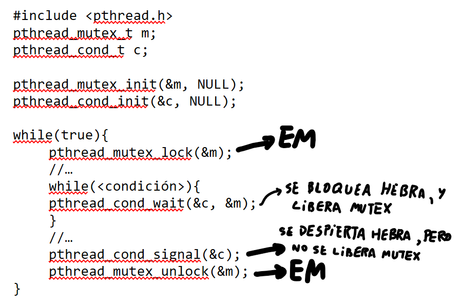

> [!definicion] Conceptos fundamentales
> * **Multiprocesamiento**: Gestión de múltiples procesos dentro de un sistema <u>multiprocesador</u>.
> * **Multiprogramación**: Gestión de múltiples procesos dentro de un sistema <u>monoprocesador</u>.
> * **Sección crítica**: Sección de código ejecutada por múltiples hebras, en la que se accede a datos compartidos, y que al menos una hebra <u>escribe sobre ellos</u>.
> * **Condición de carrera**: Cuando el resultado de una operación depende del orden de ejecución entre dos o más hebras.
> * **Exclusión mútua**: Mientras una hebra esté en una sección crítica, ninguna otra hebra podrá acceder a ella.
> * **Inanición**: Cuando existe <u>una</u> hebra que nunca logra acceder a la sección crítica (queda en `enterCS` indefinidamente)
> * ***Deadlock***: Cuando <u>todas</u> las hebras nunca logran acceder a la sección crítica (quedan en `enterCS` indefinidamente)
> * ***Busy-waiting* (espera activa) o *spin-lock* (espera cíclica)**: Cuando una hebra, mientras espera para acceder a la sección crítica, se queda constantemente ejecutando una (o un conjunto de) instrucción. 
> * **Atomicidad** de una operación: Cuando ésta se ejecuta, lo hace por completo, sin ser interrumpida, de lo contrario no se ejecuta en sí. 

> [!observacion] Algunas observaciones
> * En la imagen de un proceso, solo los datos globales y el heap son recursos compartidos, mientras que su código es de solo lectura.
> * Por definición, *deadlock* siempre implica inanición, pero la inanición no implica la ocurrencia de *deadlock*.
> * No existen secciones críticas cuando se trabaja con un proceso monohebreado.
> * No se pueden realizar suposiciones sobre la velocidad relativa, y el orden de ejecución (**concurrencia**) de las hebras.
> * Una hebra no puede ejecutar infinitamente la sección crítica.

> [!ejemplo]
> El código descrito a continuación permite añadir un nuevo elemento a una lista enlazada, inicialmente  conformada por los nodos 5 y 7; y que es ejecutado por dos hebras que añaden los nodos 1 y 3 a ésta.
>  
> En este caso, primero se ejecuta la <font color="#002060">hebra 1</font>, que asigna la memoria necesaria a una nueva lista `p`, que contiene a Lista y al nodo 3, pero que no alcanza a actualizar a la variable global producto de un cambio de contexto, y se comienza a ejecutar la <font color="#ff0000">hebra 2</font>, que si llega a ejecutar el código completamente, por lo que actualiza la lista compartida con el nodo 1.
> Finalmente, se vuelve a ejecutar la <font color="#002060">hebra 1</font>, que actualiza Lista con el valor local de `p`, que no contiene al nodo 1, retornando un resultado erróneo al esperado.  
> 
> En este caso, la sección crítica del código vendría a ser cuando se accede a la lista enlazada, y luego esta se modifica.

> [!ejemplo] Un ejemplo de un código no atómico
> Si se tiene el siguiente código en assembler, que se encarga de incrementar un valor en 1:
> <center>LOAD i, ACC</center>
> <center>INC ACC</center>
> <center>STORE ACC, i</center>
> Luego, si dicho código es ejecutado por dos hebras de forma concurrente, es posible obtener la siguiente traza:
> ⠀
> 
> |  Operación              |  i        |  $ACC_{H1}$  |  $ACC_{H2}$   |
> |:------------------------|:----------|:-------------|:--------------|
> |                         |   5       |              |               |
> |  LOAD i, ACC            |   5       |  5           |               |
> |  INC ACC                |   5       |  6           |               |
> |  --CC H1-&gt;H2--       |         5 |       6      |               |
> | LOAD i, ACC             | 5         |            6 | 5             |
> | INC ACC                 |         5 |            6 |             6 |
> | STORE ACC, i            |         6 |            6 |             6 |
> | --CC H2-&gt;H1--        |         6 |            6 |             6 |
> | STORE ACC, i            |         6 |            6 |             6 |  
> 
> En dicho caso, el valor de i pasa a ser 6, que es erróneo, dado que el valor esperado debía ser 7, al ejecutar la operación dos veces.

## Soluciones que proveen exclusión mútua
Para ello, se considera que el código de un proceso se estructura de la siguiente manera, donde `enterSC()` y `exitSC()` representan "compuertas" que bloquean y liberan el acceso a la sección crítica a otras hebras distintas a la actual.

```c
while(true){
	//...código no crítico
	//...
	enterSC();
	SC();
	exitSC();
	//...
	//...código no crítico
}
```

**Requerimientos básicos de una solución de EM**
1. Proveer exclusión mútua
2. No existir *deadlock*.
3. No existir inanición.
4. Cumplir con el principio de <u>progreso</u>: cuando la sección crítica esté libre, no se le debe negar el acceso a ninguna hebra que desee entrar a ésta.

### I. Soluciones de *hardware*
* Utilizan instrucciones atómicas
* Se pueden aplicar sin importar la cantidad de hebras.
* Pueden generar inanición[¹] —y *deadlock*[²], salvo la primera—, según el diseño del sistema operativo.

[¹]: Esto ya que, en el caso de trabajar con múltiples hebras, la selección de la siguiente puede ser arbitraria, llegándose a dar el caso que no se escoja nunca.

[²]: Dicho caso puede darse cuando ocurre un cambio de contexto mientras una hebra se encuentra en la sección crítica, y se seleccionan otras hebras de mayor prioridad a la actual, las que no puedan acceder a la sección crítica al estar ocupada y viceversa, dado que la hebra que se encuentra en la sección crítica no avanza en su ejecución al ser de menor prioridad a las que se encuentran en la cola de listos.

| Solución                                               | Descripción                                                                                                                                      | Ventajas/Desventajas                                                                                                                                                                                                                                                                                                                    |     |
| :----------------------------------------------------- | :----------------------------------------------------------------------------------------------------------------------------------------------- | :-------------------------------------------------------------------------------------------------------------------------------------------------------------------------------------------------------------------------------------------------------------------------------------------------------------------------------------- | --- |
| 1.1: **Deshabilitando las interrupciones globalmente** | Cuando una hebra entre a la sección crítica, se deshabilitarán las interrupciones del procesador, tal que cuando salga, se volverán a habilitar. | Deshabilitar las interrupciones implica que no habrán cambios de contexto, y que no se planificarán otras hebras, afectando al rendimiento del procesador.<div><br></div><div>Además, dicho mecanismo solo funciona en sistemas mono-procesador, dado que solo se estarían desactivando las interrupciones de un solo procesador.</div> |     |

| Solución                                                | Descripción                                                                                                                                                                                                                                                                                                                                                                                                                  | Ventajas/Desventajas                                                                                                                                                                                                                                                                                                     |     |
| :------------------------------------------------------ | :--------------------------------------------------------------------------------------------------------------------------------------------------------------------------------------------------------------------------------------------------------------------------------------------------------------------------------------------------------------------------------------------------------------------------- | :----------------------------------------------------------------------------------------------------------------------------------------------------------------------------------------------------------------------------------------------------------------------------------------------------------------------- | --- |
| 1.2.1: **Utilizando instrucciones atómicas especiales** | Dichas instrucciones permiten ejecutar dos instrucciones en un mismo ciclo *fetch*.<div><br></div><div>En este caso, se utiliza la instrucción *test and set*, que modifica el valor de una variable, y retorna un resultado&nbsp;`booleano`.<span style="background-color: var(--background-primary); color: var(--text-normal); font-family: var(--font-interface); font-size: var(--font-ui-medium);">&nbsp;</span></div> | Al contrario de la solución anterior, esta sí funciona para sistemas multiprocesador. <div><br></div><div>Sin embargo, esperando que se cumpla la condición&nbsp;`while(!testset(bolt))`. hace *busy-waiting*, desaprovechando al procesador.</div><div></div><div>Se puede aplicar a múltiples secciones críticas</div> |     |

 

| Solución                                                | Descripción                                                                                                                                                                                                                                                                                                                                                                                                                                                                                                                                                                                                                                                                                                                                                                                                                                                                                                                                                                                                                          | Ventajas/Desventajas                                                                                |     |
| :------------------------------------------------------ | :----------------------------------------------------------------------------------------------------------------------------------------------------------------------------------------------------------------------------------------------------------------------------------------------------------------------------------------------------------------------------------------------------------------------------------------------------------------------------------------------------------------------------------------------------------------------------------------------------------------------------------------------------------------------------------------------------------------------------------------------------------------------------------------------------------------------------------------------------------------------------------------------------------------------------------------------------------------------------------------------------------------------------------- | :-------------------------------------------------------------------------------------------------- | --- |
| 1.2.2: **Utilizando instrucciones atómicas especiales** | <div><span style="background-color: var(--background-primary); color: var(--text-normal); font-family: var(--font-interface); font-size: var(--font-ui-medium);">A diferencia del caso anterior, ahora se usa la instrucción *exchange*, que permite intercambiar los valores entre dos variables.</span><br></div><div><span style="background-color: var(--background-primary); color: var(--text-normal); font-family: var(--font-interface); font-size: var(--font-ui-medium);"><br></span></div><div><span style="background-color: var(--background-primary); color: var(--text-normal); font-family: var(--font-interface); font-size: var(--font-ui-medium);">Además de una variable&nbsp;</span><span style="background-color: var(--background-primary);">`bolt`, que indica el estado del acceso a la sección crítica, cada hebra cuenta con una variable propia&nbsp;</span><span style="background-color: var(--background-primary);">`keyi`, la cual deberá ser 0 para poder acceder a la sección crítica</span></div> | Cuenta con las mismas ventajas y desventajas de la solución anterior, al ser una variación de ésta. |     |


> [!observacion]
> La función `parbegin()` permite suspender la ejecución de la hebra en `main()`, y permite que se ejecuten concurrentemente los procedimientos entregados como parámetro.

### II. Soluciones de *software*
* No utilizan instrucciones atómicas
* Solo aplican cuando se trabajan con dos hebras a la vez.

| Solución            | Descripción                                                                                                                               | Ventajas/Desventajas                                                                                                                                                                                                                                                                                                           |     |
| :------------------ | :---------------------------------------------------------------------------------------------------------------------------------------- | :----------------------------------------------------------------------------------------------------------------------------------------------------------------------------------------------------------------------------------------------------------------------------------------------------------------------------- | --- |
| **2.1: Por turnos** | Utilizando una variable global&nbsp;`turno`, inicializada en&nbsp;`0`, que indica a que hebra le corresponde entrar a la sección crítica. | Si bien garantiza el primer requerimiento de exclusión mútua, no satisface **progreso**[¹]<div><br></div><div>Además, requiere que se ejecute primero la hebra 0, indicada por la variable `turno`, luego la 1, luego la 0 y así sucesivamente, por lo que hay una ejecución **secuencial** en lugar de una concurrente.</div> |     |

[¹]: Esto puede ocurrir bajo dos casos en específico: "cuando una hebra quiere volver a entrar a la sección crítica"; o bien "cuando una hebra A le cede el paso a otra hebra B, pero B se encuentra ejecutando código no crítico —provocando que no se actualice el valor de `turno`— por lo que cuando es el turno de A, no pueda acceder."


| Solución                                   | Descripción                                                                                                                                                       | Ventajas/Desventajas                                                                                             |     |
| :----------------------------------------- | :---------------------------------------------------------------------------------------------------------------------------------------------------------------- | :--------------------------------------------------------------------------------------------------------------- | --- |
| **2.2: Utilizando un arreglo de banderas** | En lugar de una variable global&nbsp;`turno`, se utiliza un arreglo global de 2 banderas booleanas, que indican la presencia de cada hebra en la sección crítica. | Si bien ahora satisface el requerimiento de **progreso** de la solución anterior, no asegura exclusión mútua.[¹] |     |
[¹]: Esto puede ocurrir cuando una de las hebras acaba su *quantum* asignado justo después de que hace falsa la condición `while(flag[i])`, pero antes de *setear* su `flag` y entrar a la sección crítica, tal que la otra hebra hace lo mismo, provocando que hebras puedan ejecutarse de forma concurrente dentro de la sección crítica.


| Solución                                                           | Descripción                                                                                                                                                       | Ventajas/Desventajas                                                                                                                    |
| :----------------------------------------------------------------- | :---------------------------------------------------------------------------------------------------------------------------------------------------------------- | :-------------------------------------------------------------------------------------------------------------------------------------- |
| **2.3: Intercambiando el orden de las instrucciones de `enterCS`** | Para satisfacer el requerimiento de exclusión mútua de la solución anterior, se invierte el orden de las instrucciones&nbsp;`while(flag[i]);` y `flag[j] = true;` | Puede producir *dead-lock*, si es que ambas hebras solo alcanzan a modifican el valor de su `flag[i]` antes de que acaben su *quantum*. |

 

| Solución                       | Descripción                             | Ventajas/Desventajas                                                                                                   |     |
| :----------------------------- | :-------------------------------------- | :--------------------------------------------------------------------------------------------------------------------- | --- |
| **2.4: Algoritmo de Peterson** | Combinación de las soluciones 2.1 y 2.3 | Satisface los 4 requerimientos de exclusión mútua.<div><br></div><div>Sin embargo, utiliza *busy-waiting*.&nbsp;</div> |     |


> [!ejemplo] Probando que el Algoritmo de Peterson satisface el primer requerimiento de exclusión mútua
> 
> Utilizando <u>demostración por contradicción</u>, se asume que dicha solución **no satisface dicho requerimiento**.
> 
> Lo anterior implicaría que ambas hebras ingresan a la sección crítica al mismo tiempo, que llevado a código es lo mismo que decir que `while (flag[1] && turno == 1)` como `while (flag[0] && turno == 0)` son falsas a la vez, con `flag[0]` y `flag[1]` siendo verdaderos.
> 
>   
| Hebra 0 | Hebra 1 | |
|:---------|:--------|:-|
| `flag[1] == true && turno == 1` es FALSO | `flag[0] == true && turno == 0` es FALSO  |  |
| `!(flag[1] == true && turno == 1)` es VERDADERO | `!(flag[0] == true && turno == 0)` es VERDADERO | $\sim (p ∧ q) = (\sim p \ ∨ \sim q)$  |
| <code>(!(flag[1] == true) &#124&#124 !(turno == 1))</code> es VERDADERO    | <code>!((flag[0] == true) &#124&#124 !(turno == 0))</code> es VERDADERO    |  |
| <code>(flag[1] == false &#124&#124 turno != 1)</code> es VERDADERO | <code>(flag[0] == false &#124&#124 turno != 0)</code> es VERDADERO         | Dado que por regla general no se puede asumir la velocidad con la que las hebras operan, no se puede asumir con certeza el valor actual de `turno`.<div>Sin embargo, el valor de `flag[i]` **solamente depende de la hebra a la que está asignado**, por ende, al estar dentro de la sección crítica, obligatoriamente dicho valor es `true`</div><div>Además, considerando la naturaleza de una conjunción, para que sea verdadera, basta con que uno de las proposiciones lo sea, se descarta `flag[i]`</div> |  
|<code>turno != 1</code> es VERDADERO|<code>turno != 0</code> es VERDADERO||
|<code>turno = 0</code> es VERDADERO|<code>turno = 1</code> es VERDADERO|**CONTRADICCIÓN**, <code>turno</code> no puede tener dos valores al mismo tiempo.|
Por lo tanto, es posible afirmar que el algoritmo de Peterson <u>**si satisface el primer requerimiento de exclusión mútua**</u>.

### III. Soluciones basadas en mecanismos del SO y lenguajes de programación

#### III.1. Semáforos
Un semáforo consiste en una variable especial del sistema operativo, utilizada para que dos o más hebras se señalicen mutuamente, por medio de la manipulación de un valor numérico a través de las operaciones especiales `wait(s)` (`enterSC()`) y `signal(s)` (`exitSC()`), asociadas con el bloqueo y desbloqueo de hebras respectivamente.

**Tipos de semáforos**

| Tipo                                 | Descripción                                                                                                                       | <code>wait(s)</code>                                                                                                                                         | <code>signal(s)</code>                                                                                                                                                                               |
| :----------------------------------- | :-------------------------------------------------------------------------------------------------------------------------------- | :----------------------------------------------------------------------------------------------------------------------------------------------------------- | :--------------------------------------------------------------------------------------------------------------------------------------------------------------------------------------------------- |
| Semáforos contadores                 | Su valor representa la cantidad de hebras que pueden acceder a la sección crítica, por lo que puede tomar cualquier valor entero. | Se decrementa el valor del semáforo (<code>s.value</code>) en 1; y si dicho valor pasa a ser negativo, se bloquea la hebra actual.                           | Se incrementa el valor del semáforo en 1; y si dicho valor $\geq 0$, se&nbsp; saca una hebra de la cola de bloqueados del semáforo, y pasa a estado *listo*.                                         |
| Semáforos binarios (*mutex*, *lock*) | Solo puede tomar los valores 0 y 1, indicando la presencia o ausencia de una hebra en la sección crítica.                         | Si el valor del semáforo es 1, pasa a ser 0.<div><br></div><div>De lo contrario, se bloquea la hebra actual.                                          </div> | Si no hay ninguna hebra en la cola de bloqueados, su valor pasa a ser 1.<div><br></div><div>De lo contrario, se saca una hebra de la cola de bloqueados del semáforo, y pasa a estado *listo*.</div> |
**Algunas aplicaciones**:

> [!ejemplo] El problema del productor/consumidor
> Para una colección de datos compartidos o *buffer*, operan sobre ella:
> * Una o más hebras **productoras**, que generan un dato y lo agregan a la colección. 
> * Una sola hebra **consumidora**, que extrae y utiliza un dato de la colección.
> 
> Dado lo anterior, se desea que solo un tipo de hebra pueda acceder y modificar el recurso compartido a la vez (**exclusión mútua**), para lo cual surgen las posibles soluciones:
> > [!ejemplo] Considerando una colección infinita de elementos:
> > 
> > |      | Descripción |
> > |:---|:--------|
> > | Abstracción inicial  | *Buffer* como un arreglo de elementos, donde los índices `in` y `out` indican las casillas en donde se inserta/extrae un dato, mientras que la condición `while (in == out);` verifica que el consumidor no intente acceder al *buffer* cuando está vacío.<div><br></div><div> </div>|
> > | Segunda aproximación | Utilizando la variable global `n` que representa la cantidad de casillas ocupadas, y dos semáforos binarios para asegurar EM y evitar que el consumidor acceda al *buffer* cuando está vacío.<div><br></div><div>Sin embargo, dicha aproximación es errónea, dado que el valor de `n` se puede corromper en el caso de que ocurra un cambio de contexto antes de verificar la condición <code>if (n == 0) wait (delay);</code></div><div> </div> |
> > | Solución correcta    | Se soluciona el problema anterior al crear la variable local `m` del consumidor, que permite respaldar el valor de `n`.<div><br></div><div></div> |
> > > [!observacion]
> > > Dado que solamente existe una hebra que ejecuta la función `consumer()`, quiere decir que <u>solamente se ejecutará una vez la instrucción <code>wait(delay)</code> en toda su ejecución</u>, mientras que el resto del código contenido dentro de `while(true)` será el que se ejecute cada vez.
> > 
> 
> ⠀
> 
> > [!ejemplo] Considerando una colección finita de elementos:
> > 
> > ||Descripción|
> > |:---|:--------|
> > |Aproximación| *Buffer* como un arreglo circular de tamaño `n`, se ingresan los elementos al final, y se eliminan desde el inicio.<div><br></div><div>Para apuntar al siguiente elemento: $(in/out +1) \% n$</div><div><br></div><div>El arreglo estará lleno cuando quede una sola casilla disponible, que no será utilizada.</div><div><br></div><div></div>|
> > |Solución correcta | Vector de tamaño `n`, que utiliza dos semáforos contadores que indican la cantidad de casillas libres y ocupadas, y uno binario, que asegura EM.<div><br></div><div></div>|
> > 

> [!ejemplo] El problema de los filósofos comensales
> Se tienen 5 filósofos que se sientan alrededor de una mesa con 5 platos de comida, con un tenedor por plato. Cada filósofo utiliza dos tenedores para comer, por lo que cuando solo tiene uno, o ninguno, deja de comer y se pone a filosofar. Por último, cuando un filósofo termina de comer, deja los tenedores que ocupó en la mesa.
> 
> **Aproximación 1**
> 
> Sin embargo, dicha solución puede generar *dead-lock*, en el caso de que una de las hebras acabe su *quantum* justo después de ejecutar `wait(fork[i])`, tal y como lo muestra la siguiente traza:
> 
> 
> > 
| Hebra 0 | Hebra 1                       | Hebra 2                             | Hebra 3                             | Hebra 4                             |
|:------------------------------------|:------------------------------------|:------------------------------------|:------------------------------------|:------------------------------------|
|                                     |                                     |                                     |                                     | `wait(fork[4])`                     |
|                                     |                                     |                                     |                                     | ~CC~                                |
|                                     |                                     |                                     | `wait(fork[3])`                     |                                     |
|                                     |                                     |                                     | `wait(fork[4])` -&gt; **bloqueado** |                                     |
|                                     |                                     |                                     | ~CC~                                |                                     |
|                                     |                                     | `wait(fork[2])`                     |                                     |                                     |
|                                     |                                     | `wait(fork[3])` -&gt; **bloqueado** |                                     |                                     |
|                                     |                                     | ~CC~                                |                                     |                                     |
|                                     | `wait(fork[1])`                     |                                     |                                     |                                     |
|                                     | `wait(fork[2])` -&gt; **bloqueado** |                                     |                                     |                                     |
|                                     | ~CC~                                |                                     |                                     |                                     |
| `wait(fork[0])`                     |                                     |                                     |                                     |                                     |
| `wait(fork[1])` -&gt; **bloqueado** |                                     |                                     |                                     |                                     |
| ~CC~                                |                                     |                                     |                                     |                                     |
|                                     |                                     |                                     |                                     | `wait(fork[0])` -&gt; **bloqueado** |
| *dead-lock*                         | *dead-lock*                         | *dead-lock*                         | *dead-lock*                         | *dead-lock*                         |     
>   
> **Aproximación 2**
> 
> En ésta, se utiliza un semáforo contador `room` que permite que **solo se puedan usar 4 tenedores a la vez**, dejando uno libre, similar a la solución correcta del problema anterior para un *buffer* finito de los productores/consumidores.
> 
> > [!observacion]
> > Cabe aclarar que, dado que directamente no se trabaja con datos compartidos, sino que mas bien se comparten los semáforos que representan a los tenedores, **no hay una sección crítica**.

> [!ejemplo] El problema de los lectores/escritores
> Similar al planteamiento que sugiere el problema de los productores y los consumidores, existe un dato compartido que puede ser leído por un sinnúmero de lectores de forma simultánea, pero que solamente puede ser editado por un escritor a la vez, tal que ningún lector pueda acceder al recurso mientras esté siendo escrito.
> 
> Para ello, se proponen dos alternativas de solución, cada una otorgándole cierta prioridad a cada tipo de hebra:
> 
> | Tipo de solución | Descripción |
> |:------------------|:------------|
> |Prioridad a lectores|<div><br></div><div>Sin embargo, dicha solución puede provocar inanición, dado que un escritor puede quedar esperando infinitamente a entrar a la sección crítica, si acceden una cantidad infinita de lectores a leer.</div>|
> |Prioridad a escritores||

<div style="page-break-after: always;"></div>

#### III.2. Monitores

* Módulo de software que permite la ejecución de una sola hebra dentro de sí a la vez, bloqueando a las otras hebras dentro de una cola FIFO, hasta que el monitor se desocupe.
* En base a lo anterior, es posible afirmar que <b><u>permite asegurar el primer requerimiento de exclusión mútua</u></b>
* Está compuesto[¹] de :
	* Datos locales, los cuales solo pueden ser accedidos por métodos del mismo monitor.
	* Métodos o procedimientos, los cuales una hebra puede invocar para poder entrar a éste.
	* Código de inicialización.
* Dentro de los datos locales, se encuentran las **variables de condición**, las que permiten manipular la ejecución de una hebra[²], por medio de las siguientes operaciones:
	* `cwait(c)`: Se bloquea una hebra bajo una condición `c`, pasando a la cola de dicha variable, dejando el monitor libre.
	* `csignal(c)`: Se desbloquea uno de los procesos bloqueados en la cola de la condición `c`, retomando su ejecución.

[¹]: Lo anterior lo hace similar a un objeto proveniente de POO.

[²]: Que una hebra se bloquee bajo una determinada condición es similar a como, en el problema de los escritores/lectores, una hebra quedaba haciendo *busy-waiting*/se bloqueaba cuando un arreglo se llenaba/vaciaba.

> [!observacion] Algunas observaciones
> * No existen semáforos dentro de un monitor, en su lugar existen las variables de condición, cuyas operaciones `cwait`/`csignal` son <u>semejantes</u> a los `wait`/`signal` de los semáforos binarios.
> * Las variables de condición no representan valores numéricos.
> * Luego de un `csignal()`, la hebra liberada no pasa a ejecutarse (queda en estado LISTO) sino <u>hasta que la hebra que hizo el `csignal` se deja de ejecutar</u>

#### III.3 Hebras *POSIX*
Retomando un concepto mencionado en el capítulo anterior, la API `pthreads` o **POSIX** *threads* también permite utilizar una serie de estructuras capaces de sincronizar hebras **de un mismo proceso**, para lenguajes que no cuentan nativamente con monitores, como C:

**Mutex**
Variables especiales cuyo comportamiento se asemeja a los semáforos binarios, y que cuenta con dos estados: `lock`, cuando ha sido tomado por una hebra, y `unlock` cuando no (`enterSC()` y `exitSC()`)
	
> [!ejemplo] Un ejemplo de uso...
> 
> ```C
> #include <pthread.h>
> pthread_mutex_t m;
> pthread_mutex_init(&m, NULL); //NULL: atributos por defecto
> //...
> pthread_mutex_lock(m);
> SC();
> pthread_mutex_unlock(m);
> ``` 

**Variables de condición**
Si bien cumplen el mismo rol que las variables de condición de un monitor, las variables de condición implementadas por `pthreads` suelen estar ligadas a un **mutex**, el cual liberan por medio de `pthread_cond_wait(&cond, &lock)`, bloqueando a la hebra en cuestión. 

> [!ejemplo] Un ejemplo de uso...
> 
> En general, `pthread_cond_wait(...);` siempre suele estar contenido dentro de un `while(<condición>)`

> [!observacion]
> * En general, `pthread_cond_wait(...)` suele estar contenido dentro de un `while(condición)`
> * `pthread_cond_broadcast(...)` funciona como un `signal` atómico, que despierta a todas las hebras bloqueadas por una condición, <u>al mismo tiempo</u>.

