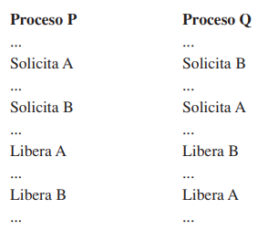
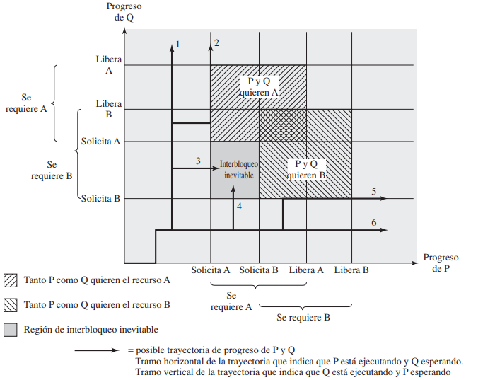
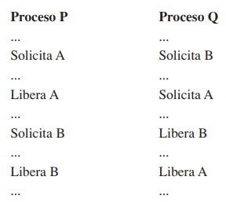
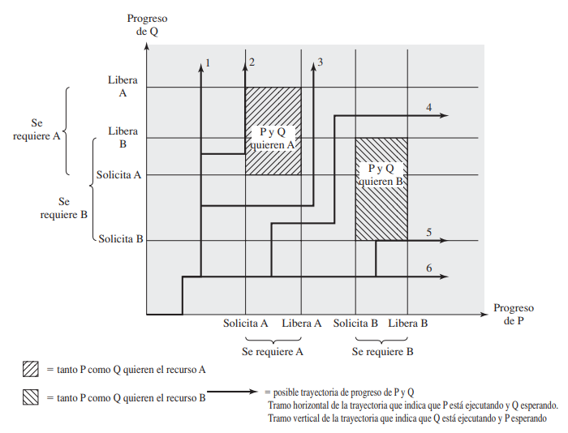
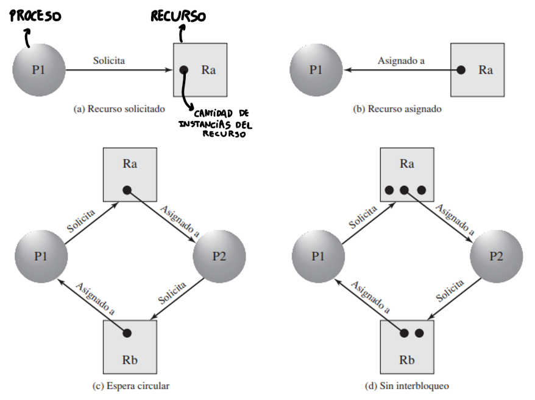

**Definición**
* "*Espera cíclica que sufren todas las hebras de un proceso, permaneciendo estancadas en su `enterSC()`, ya sea estando busy-waiting, o bloqueadas.*"
* "*Bloqueo permanente de un conjunto de procesos que: compiten por un proceso/se comunican entre sí.*[¹]"

[¹]: La segunda definición se corresponde más de acuerdo a lo visto con las soluciones de exclusión mútua. 

> [!ejemplo]
> Se tienen dos procesos P y Q que compiten por el uso de dos recursos A y B, ya sea en conjunto o por separado, cuyo comportamiento queda representado por medio del siguiente diagrama:
> 
>  
> 
> |Trayectoria|Descripción|
> |:-----------|:-----------|
> |1|Q solicita y libera B y A, tal que luego P los puede solicitar a ambos.|
> |2|Q solicita B y A, pero no libera A, provocando que P quede bloqueado esperando por el recurso.|
> |3|Q solicita B, mientras que P solicita A, pero luego Q quiere solicitar A, provocando que ambos se bloqueen (***dead-lock***)|
> |4|P solicita A, mientras que Q solicita B, pero luego P quiere solicitar B, provocando que ambos se bloqueen (***dead-lock***)|
> |5|P solicita A y B, pero no libera B, provocando que Q quede bloqueado esperando por el recurso.|
> |6|P solicita y libera A y B, tal que luego Q los puede solicitar a ambos. |
> 
> Para evitar que se produzca *dead-lock* en las trayectorias 3 y 4, se puede modificar la ejecución de las instrucciones de los procesos, tal que no lleguen a requerir de ambos recursos para su funcionamiento en algún momento dado. 
> 
>  
>
>
> |Trayectoria|Descripción|
> |:-----------|:-----------|
> |1|Q solicita y libera B y A, tal que luego P los puede solicitar a ambos.|
> |2|Q solicita B y A, pero no libera A, provocando que P quede bloqueado esperando por el recurso.|
> |3|Q solicita B, mientras que P solicita y libera A, por lo que Q puede tomar A y así liberar ambos, tal que luego P pueda tomar B. |
> |4|P solicita A, mientras que Q solicita B, tal que P libera A y Q pueda tomarlo, para luego liberar ambos, y que P pueda tomar B. |
> |5|P solicita y libera A, y luego solicita B, pero luego Q solicita B provocando que Q quede bloqueado esperando por el recurso.|
> |6|P solicita y libera A y B, tal que luego Q los puede solicitar a ambos. |
> 
> Lo anterior permite que las zonas en que P y Q requieran un recurso en común no se solapen entre sí, haciendo que desaparezca el interbloqueo inevitable.

**Tipos de recursos**

| Tipo        | Descripción                                                                                                                                                                                                                                 |
| :---------- | :------------------------------------------------------------------------------------------------------------------------------------------------------------------------------------------------------------------------------------------ |
| Reusables   | No se consumen (acaban) al ser utilizados por un proceso.
Son liberados por los procesos que los usan, para que otros accedan a ellos.

Algunos ejemplos: dispositivos de I/O, memoria principal y secundaria, archivos.
 |
| Consumibles | Creados (producidos) y destruidos dinámicamente por otros procesos.
Algunos ejemplos: interrupciones, señales, información en *buffers* de I/O
                                                                                    |

**Grafo de procuramiento de recursos**

> [!ojo] Requisitos necesarios para asegurar *dead-lock*
> * Que exista **exclusión mútua**, es decir, que solo un proceso pueda utilizar un recurso a la vez.
> * *Hold-and-wait*: Que un proceso **pueda mantener un recurso al mismo tiempo que ya se encuentra esperando por otro**.
> * Que los recursos **no se puedan desapropiar** mientras están siendo utilizados por otro proceso.

> [!observacion]
> En el contexto actual, se entenderá que **prevenir** la ocurrencia de *dead-lock* estará asociado con no permitir que ocurra <b><u>antes de la ejecución del código, que no llegue a suceder</u></b>, diseñando el sistema de forma específica; mientras que **evitarlo** se asocia con que <b><u>si llega a ocurrir, que no afecte la ejecución del código mismo</u></b>, mediante técnicas y algoritmos que tomen decisiones según el estado actual.

**Formas de <u>prevenir</u> *dead-lock***

| Tipo               | Estrategia                                                                                                                                                                                                                                                                                                                                                                                                                                                                                                                                                                      |
| :----------------- | :------------------------------------------------------------------------------------------------------------------------------------------------------------------------------------------------------------------------------------------------------------------------------------------------------------------------------------------------------------------------------------------------------------------------------------------------------------------------------------------------------------------------------------------------------------------------------ |
| Métodos indirectos | Evitar que se cumplan las condiciones obligatorias para el *deadlock*, a excepción de la exclusión mútua.
 

Sin embargo, en el caso del *hold-and-wait*, que no se cumpla puede provocar inanición
                                                                                                                                                                                                                                                                                                                                                       |
| Métodos directos   | Que no se genere espera circular; para ello, se pueden ordenar los recursos de forma lineal, exigiendo que los procesos los vayan solicitando desde el menor recurso de acuerdo a dicho orden.
 

Por ejemplo, para dos procesos $A$ y $B$ que utilizan los recursos $R_{i}$ y $R_{j}$ respectivamente. Considerando que el sistema se encuentra en *dead-lock*, para $A$, $R_{i} \lt R_{j}$, mientras que para $B$, $R_{j} \lt R_{i}$

 

Lo anterior implicaría una contradicción, dado que simulatáneamente $i \lt j$ y $j \lt i$
 |

**Formas de <b><u>evitar</u></b> *dead-lock*** (*dead-lock avoidance*):
Para este caso, si bien pueden darse las 3 condiciones necesarias para el *dead-lock*, se puede negar la asignación de recursos si es que dicha asignación puede conducir a espera circular por medio de dos técnicas:

Considerando un sistema compuesto de $n$ procesos y $m$ recursos:

| Identificador                    | Descripción                                                                                              | Representación                                                                                                                                                                   |     |
| :------------------------------- | :------------------------------------------------------------------------------------------------------- | :------------------------------------------------------------------------------------------------------------------------------------------------------------------------------- | --- |
| Arreglo $R$ de tamaño $m$        | Cantidad de instancias totales de cada recurso.                                                          | $R=(R_{1}, R_{2}, \dots, R_{m})$                                                                                                                                                 |     |
| Arreglo $V$ de tamaño $m$        | Cantidad de instancias sin asignar (disponibles) de cada recurso.                                        | $V=(V_{1}, V_{2}, \dots, V_{m})$                                                                                                                                                 |     |
| Matriz $C$ de tamaño $n\times m$ | Cada casilla $C[i][j]$ representa la cantidad de instancias $j$ solicitadas por un proceso $i$           | $C=\begin{bmatrix}C_{11} & C_{12} & \cdots & C_{1m} \\ C_{21} & C_{22} & \cdots & C_{2m} \\ \vdots & \vdots & \vdots & \vdots \\ C_{n1} & C_{n2} & \cdots & C_{nm}\end{bmatrix}$ |     |
| Matriz $A$ de tamaño $n\times m$ | Cada casilla $A[i][j]$ representa la cantidad de instancias de un recurso $j$ asignadas a un proceso $i$ | $A=\begin{bmatrix}A_{11} & A_{12} & \cdots & A_{1m} \\ A_{21} & A_{22} & \cdots & A_{2m} \\ \vdots & \vdots & \vdots & \vdots \\ A_{n1} & A_{n2} & \cdots & A_{nm}\end{bmatrix}$ |     |

Donde dichas estructuras cumplen con las siguientes relaciones:

| Relación                                                                                 | Formula                               |     |
| :--------------------------------------------------------------------------------------- | :------------------------------------ | --- |
| 1. Todos los recursos están disponibles o asignados.                                     | $R_{j}=V_{j}\ + \sum_{i=1}^{n}A_{ij}$ |     |
| 2. Ningún proceso puede solicitar más recursos de los que hay disponibles en el sistema. | $C_{ij} \leq R_{j}$                   |     |
| 3. A un proceso no se le pueden asignar más recursos de un tipo, de los que ya pidió     | $A_{ij} \leq C_{ij}$                  |     |

| Solución                                                                  | Descripción                                                                                                                                                                                                                                                                                                                                                                                                                                           |
| :------------------------------------------------------------------------ | :---------------------------------------------------------------------------------------------------------------------------------------------------------------------------------------------------------------------------------------------------------------------------------------------------------------------------------------------------------------------------------------------------------------------------------------------------- |
| Denegar el inicio de un proceso                                           | Un proceso $P_{n+1}$ se inicia **si y solo si** se pueden satisfacer las necesidades máximas de todos los procesos actuales, más las del proceso a iniciar.
$$R_{j} \geq C_{(n+1)j} + \sum_{i=1}^{n} C_{ij}, \forall x$$

Sin embargo, dicha estrategia asume el peor caso, que todos los procesos necesitarán todas las instancias de los recursos simultáneamente.
                                                               |
| Denegar la asignación de recursos a un proceso (*algoritmo del banquero*) | Por medio de una serie de "estados" del sistema, que reflejan la asignación actual de recursos a procesos, se busca aquella secuencia de asignación que no implique *deadlock*, recibiendo el nombre de **estado seguro**.
 

$$C_{ij} - A_{ij} \leq V_{j}, \forall j$$

En cada estado, se revisa si existe algún proceso al que se le puedan asignar los recursos necesarios para que termine su ejecución.

 

<b>Asegura que nunca ocurrirá <i>deadlock</i></b>
 |
