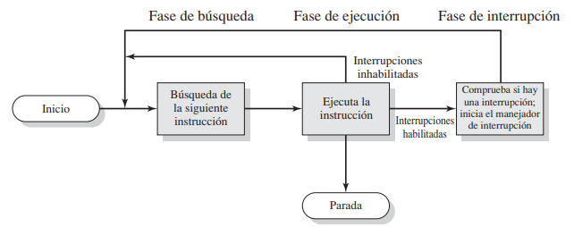
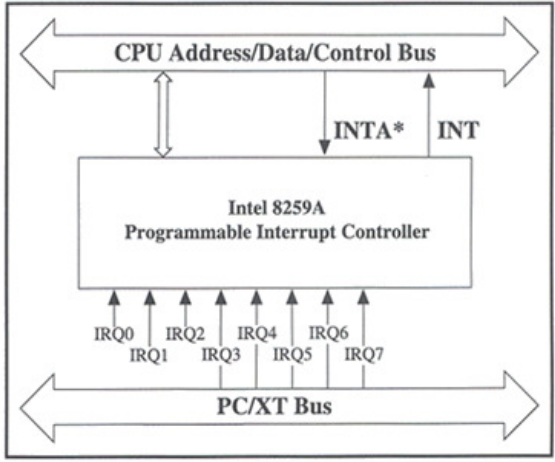
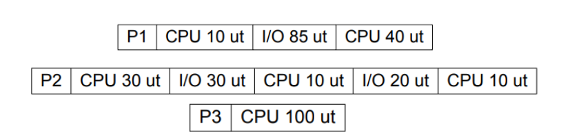
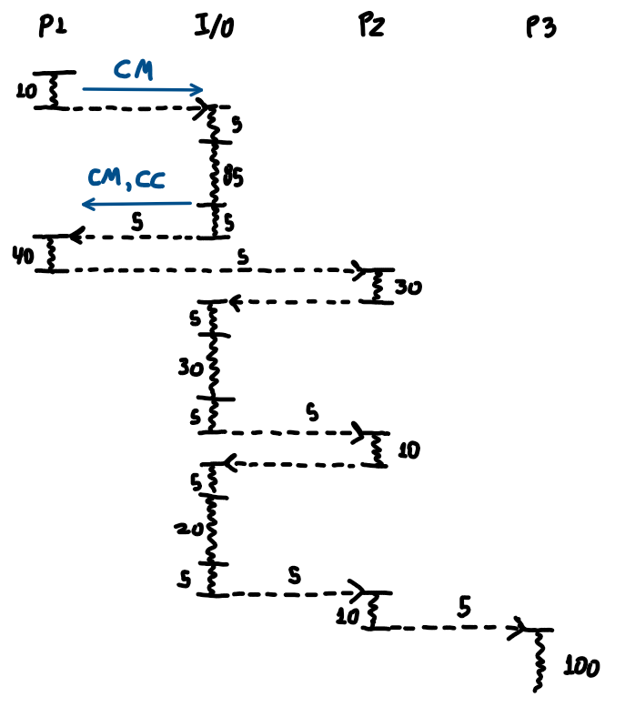
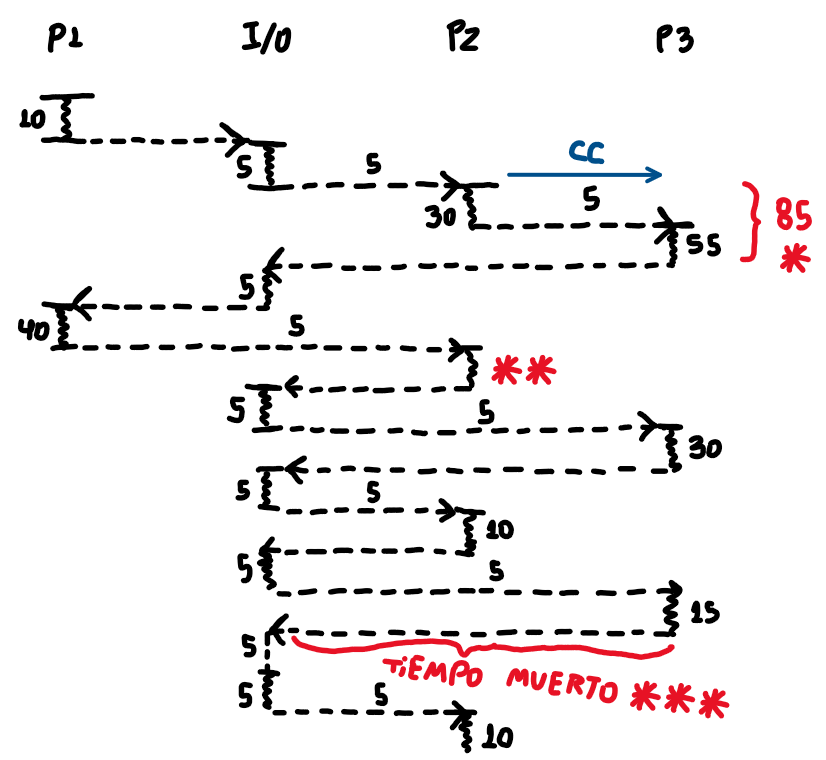
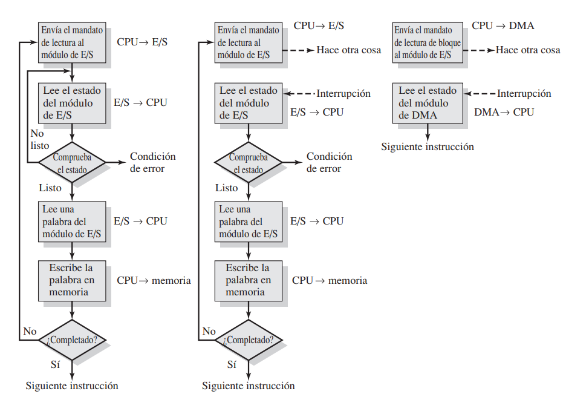

**Definición**
* Evento en el que el sistema requiere alterar la secuencia normal de ejecución, forzando al procesador a ejecutar instrucciones en modo *kernel*.

* Cada interrupción cuenta con un identificador único (IRQ: *Interruption Request*), que toma un valor entre 0 y 255.
* Al iniciar el sistema, cada controlador del sistema va registrando su respectivo manejador de interrupciones 
* Al iniciar el sistema, el SO genera una tabla de interrupciones que permite asociar cada IRQ con un manejador de interrupciones en específico.
	* Específicamente, durante el *booteo*, cada controlador y dispositivo de I/O va registrando sus manejadores y recibiendo su respectivo IRQ por medio de `request_irq()`, y liberándolo con `free_irq()`

 Tal y como se puede apreciar en la imagen, a medida que se van recibiendo señales de interrupción (en este caso, IRQ₁, ₂, ...), el PIC escoge la de menor valor y notifica al procesador de ésta por medio de la señal INT, la cual reconoce y notifica de su reconocimiento de vuelta al PIC con la señal INTA (*Interruption Acknowledge*)

**Orden cronológico del manejo de una interrupción**
Desde el punto de vista del <i><u>hardware</u></i>, se emite una señal de interrupción de parte de un controlador u otro dispositivo de I/O, tal que es reconocida por el procesador una vez finalizada la instrucción actual del ciclo *fetch*, lo que hace que almacene los valores actuales de los registros PC[¹] y PSW[²] dentro del *stack* de control[³], y actualice el valor del PC con el del manejador de instrucciones respectivo, que se ejecuta a continuación.

En la parte del <i><u>software</u></i>, una vez en ejecución, el manejador guarda toda la información del resto de registros del sistema hasta dicho punto dentro del *stack* de control, y procesa la interrupción en sí. Una vez hecho lo anterior, restituye primero el resto de registros, y luego el PC y PSW, tal que, de acuerdo al caso:
* Se ejecute el programa previamente interrumpido desde el punto de la interrupción.
* Se ejecute otro programa del cual se haya tenido registro.
* No se pueda recuperar del error.

En simples palabras, la interrupción es <u>generada</u> por el *hardware*, y es <u>manejada</u> por el *software*.

[¹]: ⠀ **PC** (*program counter*) (también conocido como **EIP**): Contiene la (dirección de la) siguiente instrucción a ejecutar.
[²]: ⠀ **PSW** (*program status word*) (también conocido como **EFLAGS**): Contiene toda la información relacionada a la ejecución del proceso, como de la interrupción que lo generó.
[³]: ⠀ El PC y el PSW se guardan en el *hardware* a modo de respaldo, ya que contienen los datos necesarios para poder restituir un proceso, una vez se termine de ejecutar el manejador de interrupciones; además, es importante recalcar que **ambos** deben referenciar al mismo proceso.

> [!observacion] Observación
> Si ya se está atendiendo una interrupción, y llegan otras más, el procesador tiene dos formas de lidiar con ello:
> * Se ignora hasta terminar de atender a la actual (**maskable**)
> * Se deja de atender a la interrupción actual, y se atiende a la nueva (**non-maskable**)
> 
> Lo anterior queda dictaminado por el *bit* IF (*Interruption enable Flag*), donde 0 -> inhabilita y 1 -> habilita, por medio de las instrucciones `cli` y `STI` respectivamente.

<u><b>Tipos de excepciones</b></u>

| Por su denominación (*Intel*) | Descripción                                                                                                                                                                                    |
| :---------------------------- | :--------------------------------------------------------------------------------------------------------------------------------------------------------------------------------------------- |
| Excepciones                   | Síncronas, ocurren al final del ciclo *fetch*, siendo reconocidas por el procesador durante este mísmo.  Incluye a eventos internos, división por cero, `syscall`, problemas de memoria. |
| Interrupciones                | Asíncronas, ocurren sin que el procesador las reconozca de inmediato.  Incluye a eventos de I/O o por reloj (*quantum*)                                                                  |

| Por su naturaleza | Descripción                                                                                                                                                 |
| :---------------- | :---------------------------------------------------------------------------------------------------------------------------------------------------------- |
| `trap`            | Excepción intencional de *hardware*, permite conocer si una excepción/error es recuperable o no.                                                            |
| `fault`           | Error potencialmente recuperable; existen de dos tipos:<ul><li>`page fault`: error recuperable</li><li>`segmentation fault`: error no recuperable</li></ul> |
| `abort`           | Error no recuperable                                                                                                                                        |
| `syscall`         | Generado por *software*, puede implicar un `trap`; llamada explicita a una función del sistema operativo.                                                   |

> [!observacion]
> Algunas funciones que generan un llamado al sistema o `syscall` son: `read`, `write`, `sleep`, `wait`, `malloc`, `calloc`, y las de la familia de `fork` y `exec`

**Manejo de interrupciones de I/O**
Durante la ejecución de un programa, al encontrar una instrucción de I/O (`read`, `write`), el control de la ejecución pasa del procesador al dispositivo de I/O respectivo, el cual lleva a cabo los siguientes pasos para lograr su cometido.

* \[*software*] Inicialización: El *driver* se comunica con el controlador, para preparar la operación.
* \[*hardware*] Transferencia: Los datos fluyen desde el dispositivo a los *buffers* del SO.
* \[*software*] Finalización: El *driver* finaliza la operación, liberando memoria, y cortando la comunicación con el controlador.

> [!ojo] 
> Un controlador y un *driver* no son lo mismo; el controlador está a nivel de *hardware*, mientras que el *driver* está a nivel de *software*, sirviéndole al controlador.

Sin embargo, existen 3 tipos de técnicas para llevar a cabo dicha comunicación:

**I/O programado (sin interrupciones)**
* Durante la transferencia de datos, el procesador comprueba periódicamente el estado del módulo de I/O (*polling*) hasta que la operación se haya completado.
* Dicho método es considerado obsoleto, además que desperdicia tiempo y desaprovecha el procesador.

**I/O con interrupciones**
* Durante la transferencia de datos, en lugar de comprobar constantemente el estado de la operación, el procesador destina dicho tiempo a planificar otro proceso que esté pendiente por ejecutarse, tal que "cuando éste se agote"[¹], se interrumpe al proceso siendo planificado, y se continua con el I/O del proceso original. 
* Permite disminuir el tiempo de *overhead*[²], eliminando el tiempo de transferencia de I/O, y aumentando la utilización del procesador

$$\text{Utilización del procesador: } \frac{T_{procesos}}{T_{procesos} + T_{overhead}}$$

[¹]: También entendido como "cuando se acabe el *quantum* de tiempo".
[²]: También entendido como el "tiempo de sobrecarga", o el tiempo que no está destinado para los procesos.

> [!observacion] Observaciones:
> * Para un proceso que hará una operación de I/O, en un modelo que utiliza I/O programado, se ejecuta una instrucción `jump`, generando un cambio de modo de ejecución de usuario a *kernel*.
> * Por otro lado, cuando ocurre lo mismo en un modelo que si utiliza interrupciones, se genera una interrupción de tipo `trap (syscall)`, provocando igualmente un cambio de modo de ejecución.
> * El tiempo transcurrido entre que...
> 	* ...termina una operación de I/O y se reanuda la ejecución de un proceso por la CPU...
> 	* ...termina de ejecutarse un proceso por completo, y comienza a ejecutarse otro...
> 	* ...o se comienza/termina de planificar un proceso, y se devuelve el control al modulo de I/O...
> * ...corresponde al <u>tiempo en el que el SO escoge un proceso</u>.

> [!ejercicio] Ejercicio 1
> Calcule la utilización con y sin interrupciones para un sistema con las siguientes características:
> * Al SO le toma 5 u.t. escoger un proceso.
> * La inicialización y finalización de I/O toman 5 u.t.
> * Se le da mayor prioridad de ejecución al proceso con el menor indice $k$
> * Las llamadas de I/O no se interfieren entre sí.
> 
> 
> 
<u>Sin interrupciones</u>:

> 
> $$ \begin{gathered} T_{procesos}:10+40+30+10+10+100 =200 \\ \\
> T_{overhead}: ((5 \cdot 2) \cdot 3) + (85+30+20)+5\cdot 5=30+135+25=190 \\ \\
>U=\frac{200}{200+190}=\frac{200}{390} \\ \\
>\approx 51.28 \% \ \text{de utilización} \end{gathered}$$
> 
> 
<u>Con interrupciones</u>:

> 
> $$
> \begin{gathered}
> T_{procesos}: 10+40+30+10+10+55+30+15=200 \\ \\
> T_{overhead}: ((5 \cdot 2) \cdot 3) + 5 \cdot 8 + 5 = 30 + 40 + 5 = 75 \\ \\
> U=\frac{200}{275} \\ \\
> \approx 72.72 \text{\% de utilización} \end{gathered}
> $$
> 
> 
> [*]: Dado que el tiempo de planificación de P1 era mayor al tiempo de CPU de P2, se comenzó a planificar el siguiente proceso, en este caso P3.
> [**]: Como ya se planificó la primera porción de CPU de P2 por completo, se trabaja en su I/O en su lugar, para lo cual primero se debe dirigir al proceso en sí, aunque no se haga uso del procesador.
> [***]: Ocurre lo mismo que en el primer caso, salvo que ahora ya no quedan procesos por planificar, por ende se considera "tiempo muerto" en I/O.

**I/O con DMA (*direct memory access*)**
* Al contrario de las anteriores, este método no involucra activamente al procesador, mas allá de delegarle el control de la ejecución al módulo de DMA al detectar una operación de I/O, tal que el procesador puede llevar a cabo cualquier otra tarea durante ello.
* Se suele usar cuando se necesita transferir un gran volumen de datos, donde el módulo de DMA toma el control del *bus* del sistema, generando una competencia por el uso de éste entre el procesador y el DMA.
* Por lo mencionado anteriormente, dicha técnica no requiere del uso de interrupciones.
