### Definición
* Un programa en ejecución.
* Una instancia de un programa ejecutado en un procesador. 
* "*Una unidad de actividad que se caracteriza por la ejecución de una secuencia de instrucciones, un estado actual, y un conjunto de recursos del sistema asociados.*"

> [!observacion] Observaciones
> * Un programa y un proceso <u>no son lo mismo</u>:
> 	* Un programa viene a ser un conjunto de instrucciones en un lenguaje de programación en particular.
> 	* Un proceso viene a ser dicho conjunto de instrucciones, que ha sido *linkeado*, y cargado en memoria.
> * Similar (**pero no igual**) al concepto de proceso, es posible describir a un sistema operativo/*kernel* como una secuencia de instrucciones en memoria, sirviendo como una capa de *software* entre las aplicaciones y el *hardware*.

> [!observacion] Transformación de un programa a un programa ejecutable (potencial proceso)
> 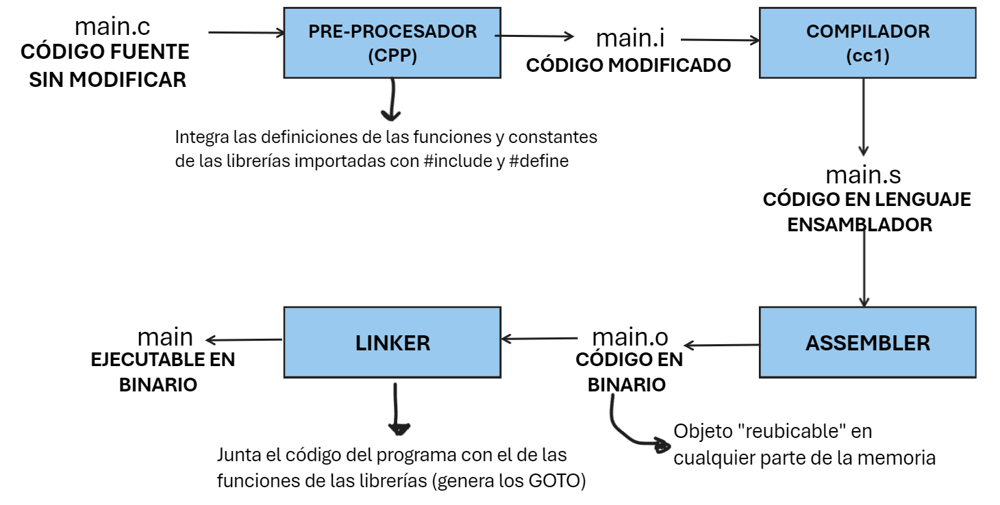

Durante la ejecución de un proceso, se organiza la información relacionada a este en ciertas estructuras de datos, las cuales son:

| Estructura                                                                                              | Descripción                                                                                                                                                                                                                                                                                                                                                                                                                                                                                                                                                                                                                                                                                                                                                                                                                                                                                       | Diagrama               |
| :------------------------------------------------------------------------------------------------------ | :------------------------------------------------------------------------------------------------------------------------------------------------------------------------------------------------------------------------------------------------------------------------------------------------------------------------------------------------------------------------------------------------------------------------------------------------------------------------------------------------------------------------------------------------------------------------------------------------------------------------------------------------------------------------------------------------------------------------------------------------------------------------------------------------------------------------------------------------------------------------------------------------ | :--------------------- |
| **Bloque de control** del proceso (**PCB**) (también llamado "**descriptor**" del proceso)              | Contiene su identificador (PIB), su estado actual (corriendo, listo, etc.), su prioridad, el PC, el contexto del proceso (registros del procesador), etc.<br><br>Además de lo anterior, el PCB contiene punteros a memoria, que apuntan al código y datos del proceso mismo, y además de punteros a memoria compartida entre dos o más procesos.                                                                                                                                                                                                                                                                                                                                                                                                                                                                                                                                                  | 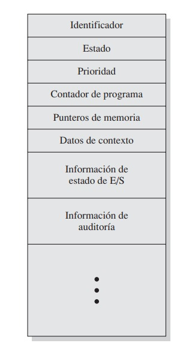     |
| <br>**Espacio virtual de direcciones del proceso** (**EVD**) (también llamado "**imagen**" del proceso) | <br>**Código/Texto**: código del proceso.¹<br>**Datos globales**: variables y funciones globales.<br>**Heap**: Asignaciones de memoria, como `malloc` y `calloc`<br>↓↑: Librerías dinámicas/estáticas que se van cargando en tiempo de ejecución (*linker*)<br>***Stack* del usuario**: Variables y funciones locales dentro de `main`, incluyendo los parámetros de entrada de éste.<br> Otra forma de entenderlo es que registra las llamadas (`call`) a procedimientos (`jump`) y los parámetros pasados entre dichos procedimientos.<br>***Stack* del kernel**: Invisible para el programador; de la misma forma que el stack de usuario, registra las llamadas (`syscall`)² a operaciones de I/O reservadas del sistema.<br><br>**OJO**: Si se tiene un puntero fuera del bloque `main`, como `*a`:<ul><li><code>*a</code>: Variable global</li><li><code>a</code>: Variable local</li></ul> | <br> 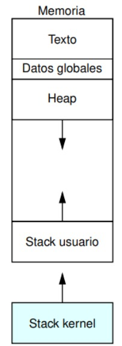 |
| **Contexto del proceso**                                                                                | Toda la información relacionada al proceso actual en un instante, tal que puede suspenderse y volverse a reanudar en otro momento; incluye a los registros PC, PSW/EFLAGS, *stack* de control, etc.<br><br>**Contexto de *hardware***: Registros que <u>si o si</u> se deben cargar para reanudar la ejecución del proceso.                                                                                                                                                                                                                                                                                                                                                                                                                                                                                                                                                                       |                        |

[¹]: En un ciclo *fetch*, se va trayendo uno a uno cada instrucción del proceso en ejecución en el procesador.

[²]: Por ejemplo, si durante la ejecución de un proceso, se lee una instrucción que implica llamar a una función que utiliza I/O, el código asociado a ésta se encontrará dentro del *stack* de *kernel*, por lo cual para acceder a éste se debe realizar un `syscall` (interrupción de tipo `trap`), provocando un cambio de modo de ejecución (usuario -> *kernel*)³

[³]: Lo anterior puede además implicar un cambio de contexto, de acuerdo al tipo de SO.

> [!observacion] Observaciones
> 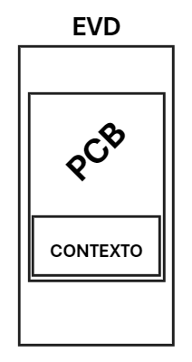
> * Dentro del EVD se encuentra contenido el PCB, quien a su vez también almacena el contexto del proceso.
> * Cuando un proceso se termina de ejecutar, se libera toda la memoria asociada a él, incluyendo la memoria virtual.
> * Durante el manejo de una interrupción por la parte del *hardware*, se deben almacenar el PC y el PSW (contexto de *hardware*), dado que luego estos serán sobrescritos por los datos del respectivo manejador de la interrupción.
> * Dentro del PSW, existe un bit que indica el modo de ejecución de un programa.

<div style="page-break-after: always;"></div>

### Estados de un proceso
#### Modelo de 7 estados
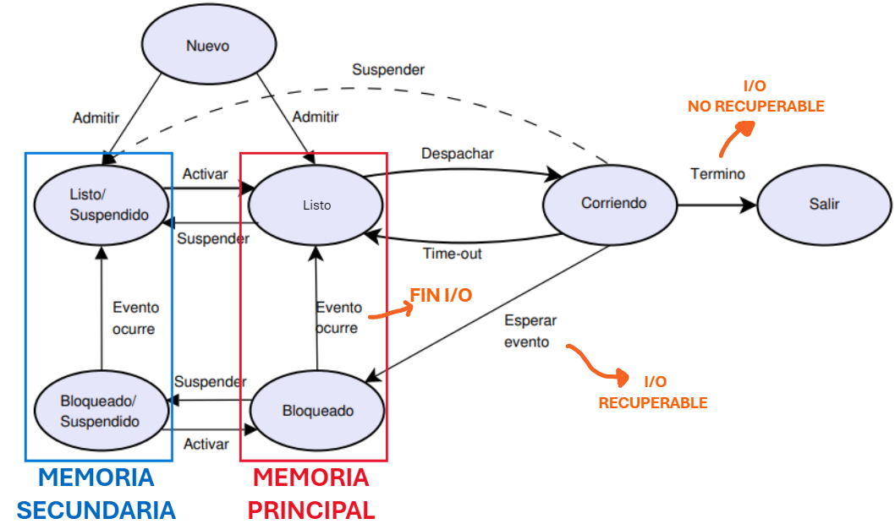

> [!observacion] Algunas observaciones
> * Ningún proceso *bloqueado* o *suspendido* puede entrar a ejecutarse en el procesador.
> * **Bloqueado/Suspendido -> Bloqueado**: Puede ocurrir cuando hay un proceso *bloqueado* en disco que cuente con mayor prioridad que los procesos que están en la cola de *Listo/Suspendido*.
> * **Nuevo -> Listo/Suspendido**: Puede ocurrir cuando no haya suficiente espacio en memoria principal.
> * **Listo -> Listo/Suspendido**: Puede ocurrir cuando un proceso *listo* ocupe mucho espacio en memoria principal, o bien éste tenga menor prioridad en comparación a un proceso *bloqueado* de alta prioridad,
> * **Corriendo -> Listo/Suspendido**: Puede ocurrir cuando se desapropia un proceso en ejecución, favoreciendo a otro proceso que se haya *desbloqueado* recientemente, y que tenga mayor prioridad. 

> [!observacion] *Swapping*
> En el caso de que todos los procesos en memoria principal estén *bloqueados*, es posible mover total o parcialmente alguno de éstos a memoria secundaria (disco)¹, moviendo su PCB a una cola de *suspendidos*, liberando espacio en memoria y mejorando la utilización del procesador.
> Cabe mencionar que este mecanismo corresponde a una operación de I/O.
> 
> [¹]: Generalmente, las operaciones de I/O suelen ser más rápidas en el disco que en otros controladores.

<div style="page-break-after: always;"></div>

> [!ejemplo]
> 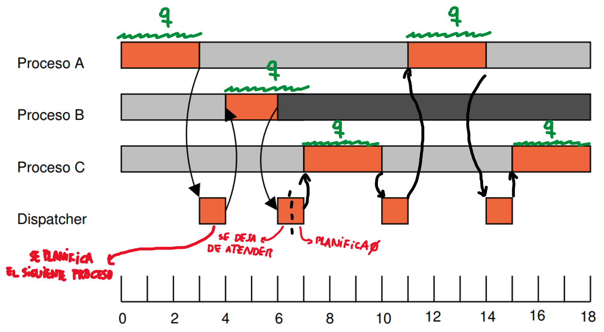
> Se tienen 3 procesos A, B, y C, los cuales esperan por entrar al procesador¹, el cuál solamente permite que se ejecuten durante un determinado *quantum q* de tiempo, tal que pasado ese tiempo los saca del procesador —volviendo a la cola de listos— y comienza a planificar al siguiente proceso, generando un cambio de modo.
> 
> Sin embargo, durante la ejecución de B, se lee una instrucción de I/O, lo cual implica la intervención del módulo de I/O, por lo que se deja de atender a dicho proceso, quedando bloqueado hasta que se termine de atender dicho requerimiento, y se pasa a planificar el siguiente proceso.
> 
> En base a ello, es posible redefinir la tasa de utilización del procesador como:$$U=\frac{T_{quantum}}{T_{quantum} + T_{planificación}}$$
> [¹]: Otra forma de decir que un proceso se va a ejecutar.

> [!observacion] Organización de los procesos de acuerdo a su estado
> 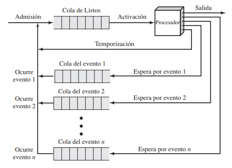
Comúnmente, los procesos se organizan en colas, donde los procesos *listos* esperan a ser aceptados por el procesador y ejecutarse en éste. Sin embargo, —considerando una planificación de tipo RR— un proceso puede solo ejecutarse durante un determinado *quantum* de tiempo, tal que al acabársele (*time-out*), es desapropiado y se posiciona¹ al final de la cola de *listos*, esperando por continuar su ejecución.
> Por otro lado, si durante su ejecución solicita una operación de I/O, o bien es interrumpido por una señal externa, se *bloquea*, y se coloca al final de una cola de *bloqueados*², donde el primero de ésta —una vez que ocurre un evento que lo desbloquea—, se sitúa al final de la cola de listos.
> 
> [¹]: Al Cuando un proceso "se mueve" o "pasa de una cola a otra", se refiere a que <u>lo hace su PCB, actualizando el estado del proceso mísmo.</u>

> [²]: Existen tantas colas de *bloqueados* por tipos de señales de bloqueo (I/O, Ctrl-Z, etc)

#### Otros tipos de modelos

> [!observacion] Modelo de estados en UNIX
> * En éste, el estado *expulsado* se refiere a aquellos procesos que han sido desapropiados por un planificador, mientras que *dormido en memoria* corresponden a procesos *bloqueados*.
> 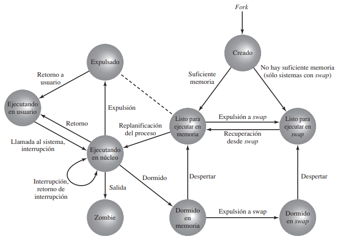

> [!observacion] Modelo de estados en LINUX
> * `TASK_INTERRUPTIBLE`: Proceso *bloqueado* (ya sea en memoria principal o secundaria)
> * `TASK_STOPPED`: Proceso desapropiado.
> * `TASK_UNINTERRUPTIBLE`: Tipo de *bloqueado*, provocado por una condición de *hardware*; no se le puede hacer `kill`
> 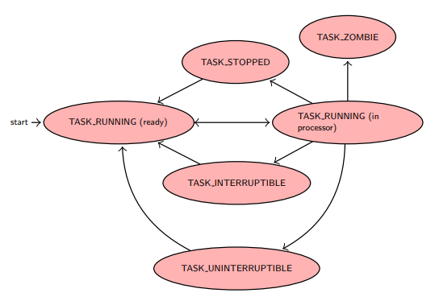
#### Cambios de contexto
"*Cuando el procesador comienza o reanuda la ejecución de un proceso distinto al actual.*" [¹]

Es generado por interrupciones de *time-out*, fallo de memoria (`fault`), `trap`, o por un llamado al sistema (`syscall`) 

Cuando ocurre uno, se debe guardar el estado actual del procesador (incluyendo al PC y otros registros), y se actualiza el PCB del proceso a reemplazar, moviéndolo a la cola de listos/bloqueados según corresponda. 

Luego, de acuerdo al criterio del respectivo planificador, se escoge un nuevo proceso, actualizando su PCB, se actualizan las estructuras de datos de gestión de memoria (tablas de pagina, segmento, marco, ...), y se restaura el estado anterior del procesador. 

> [!observacion] Desde el punto de vista del procesador...⠀
> Un proceso no viene a ser más que un contexto específico, por lo que al cambiar el proceso actual, entra al procesador otro contexto distinto al actual.

[¹]: A partir de dicha definición, es posible entender también entender un cambio de contexto como un <u>cambio de estado de un proceso</u>.

#### Formas de ejecución del SO:
1. <u>Dentro del contexto de un proceso usuario</u>![[dentroContextoPU.png|inlR|300]]
	El SO —específicamente sus subrutinas— se instala dentro del EVD de cada proceso, por medio del stack de *kernel*.
	Solo ocurre cambio de contexto al cambiar de proceso.
2. <u>Como una colección de procesos</u>:
	Tal y como su nombre indica, las principales funciones del *kernel* (o núcleo) se dividen en procesos independientes entre sí, tal que la mayor parte del tiempo se lleva a cabo tanto un cambio de contexto, como de modo¹. 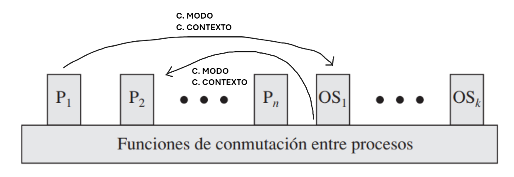 

[¹]: Sin embargo, si al terminar de ejecutar un proceso del SO, y se requiere de otro, ello solamente implicaría un cambio de contexto.

### Creación de procesos

| Método   | Descripción                                                                                                                                                                                                                              |
| :------- | :--------------------------------------------------------------------------------------------------------------------------------------------------------------------------------------------------------------------------------------- |
| `fork()` | A partir de un proceso "padre", se crea un proceso "hijo", una copia exacta del original, salvo por su&nbsp;`PID`[¹]<div>Retorna el&nbsp;`PID` del hijo, para el proceso padre, o -1 si es que falla; y 0 para el proceso hijo.[³]</div> |
| `exec()` | Permite sobrescribir a un programa actual por uno nuevo, cuyo código se pasa como argumento de entrada a la función `execv()`[²], retornando `-1` en caso de error; de lo contrario no retorna nada.                                     |

[¹]: Sin embargo, al hacer una modificación en el proceso hijo, ésta no se ve reflejada en el proceso padre.

[²]: Específicamente, `execv(<ruta al código del nuevo programa desde el directorio actual>, <parámetros de entrada>)`

[³]: Dicho valor es retornado al hijo cuando éste comienza a ejecutarse, luego de pasar por la cola de *listos* y ser aceptado.

> [!ejemplo] Ejemplo de `fork`
> Por ejemplo, si se tiene el siguiente código:
> ```c
> main()
> {
> 	int pid;
> 	if ((pid = fork()) == -1){ //En caso de error
> 		printf("No se pudo crear el hijo");
> 		return;
> 	}
> 	if (pid == 0){ //Lo ejecuta el hijo
> 		printf("Mi PID es = %d\n", getpid());
> 		printf("PID de mi padre = %d\n", getppid());
> 	}
> 	else{ //Lo ejecuta el padre
> 		printf("PID de mi hijo = %d\n", pid);
> 		printf("Mi PID es = %d\n", getpid());
> 	}
> }
> ```
> * El orden de ejecución entre el padre y el hijo suele no tomarse en consideración, dado que puede ser distinto entre sistemas.

### Planificación de procesos

| Tipo                           | Procesos en estado                   | Descripción                                                                                                                                                                                                   |
| :----------------------------- | :----------------------------------- | :------------------------------------------------------------------------------------------------------------------------------------------------------------------------------------------------------------ |
| Largo plazo (menor frecuencia) | NUEVO -> LISTO o<br>LISTO/SUSPENDIDO | Controla la creación de procesos, al ir decidiendo que procesos *nuevos* son admitidos en la cola de *listos*.<br><br>Además, controla el grado de multi-programación según la cantidad de procesos creados.¹ |
| Mediano plazo                  | LISTO <-> LISTO/SUSPENDIDO           | Decide si llevar un proceso *listo* parcial o totalmente, de la memoria principal al disco y viceversa (*swapping*)                                                                                           |
| Corto plazo (mayor frecuencia) | LISTO -> CORRIENDO                   | Decide que proceso se ejecutará a continuación en el procesador (CORRIENDO)                                                                                                                                   |
| I/O                            |                                      | Decide que proceso de I/O se ejecuta primero.                                                                                                                                                                 |

[¹]:  A mayor cantidad de procesos creados, menor tiempo tienen para ejecutarse dentro del procesador (más procesos compiten por la misma cantidad de tiempo de procesador)

#### Criterios de planificación (en el corto plazo)
| Criterio                              | Estrategia                          | Tipos                                                                                     |
| :------------------------------------ | :---------------------------------- | :---------------------------------------------------------------------------------------- |
| Orientado al usuario o a los procesos | Minimizar                           | Tiempo de respuesta, tiempo de estancia o ejecución², previsibilidad o tiempo de espera³. |
| Orientado al sistema o al procesador  | Maximizar (eficiencia, utilización) | *throughput*: cantidad de procesos finalizados por unidad de tiempo.                      |

[²]: Para ello, se utiliza el *turn-around time* o *TAT*. que se obtiene como $|T_{llegada} - T_{servicio}|$, a lo cual también se le incluye el tiempo de *overhead*.

[³]: Lo mismo que el *TAT*, pero no incluye la carga del sistema (*overhead*)


> [!observacion] Algunos conceptos relevantes
> * ***CPU o I/O-bound process***: Proceso que hace uso intensivo del procesador/realiza muchas operaciones de I/O.
> * **Ráfaga de I/O o procesador**: Cada vez que un proceso se bloquea esperando por I/O o pasa por el procesador.
> * **Planificación desapropiativa (*preemptive*)**: Es posible sacar un proceso ejecutándose en el procesador a la fuerza, para darle prioridad a otro. 
> * **Planificación apropiativa (*non-preemptive*)**: Un proceso solo sale del procesador una vez que termine su ejecución, o que lo haga de forma voluntaria (I/O, finalización, señales de tipo `kill`, `debug`, CTRL + Z).

#### Algoritmos simples de planificación

| Nombre                               | Descripción                                                                                                                                                                                                                                                                                            | Desventajas                                                       | ¿Apropiativo? | ¿Inanición?                                                         |
| :----------------------------------- | :----------------------------------------------------------------------------------------------------------------------------------------------------------------------------------------------------------------------------------------------------------------------------------------------------- | :---------------------------------------------------------------- | :------------ | :------------------------------------------------------------------ |
| FCFS/FIFO                            | Se prioriza al primer proceso que que se encuentra en la cola de *listos*.<br><br>Favorece a los procesos *CPU-bound*, al aumentar el tiempo de operación/servicio.                                                                                                                                    | Perjudicial para procesos cortos e *I/O bound*; bajo rendimiento. | Si            | No                                                                  |
| Round Robin (RR)                     | Todos los procesos se ejecutan durante un determinado quantum *q* de tiempo en el procesador. Puede generar menos cambios de contexto a un mayor *q*.                                                                                                                                                  | Bajo rendimiento; ante un mayor *q*, mayor tiempo de espera       | No            | No                                                                  |
| RR virtual                           | Orientado a procesos *I/O bound*, al bloquearse antes de finalizar su *q* (queda un *q - s* restante)<br><br>Una vez ocurrido el evento que lo desbloquea, cada proceso se va apilando en colas auxiliares de mayor prioridad, de acuerdo al *q* sobrante.                                             |                                                                   |               |                                                                     |
| SPN (*Shortest Process Next*)        | Se escoge al proceso con menor tiempo de servicio. Alto rendimiento.                                                                                                                                                                                                                                   | Puede producir inanición para procesos largos.                    | Si            | No, pero pueden sufrir de acuerdo al tiempo que tomen los procesos. |
| SRT (*Shortest Remaining Time next*) | Se escoge al proceso con menor tiempo de servicio restante, respecto del actual. Alto rendimiento.                                                                                                                                                                                                     | Puede producir inanición para procesos largos.                    | No            | No, pero pueden sufrir de acuerdo al tiempo que tomen los procesos. |
| HRRN (*Highest Response Ratio Next*) | Se escoge al proceso que cuente con el mayor razón $R=\frac{w+s}{s}$, donde $w$ y $s$ representan su tiempo en la cola y su tiempo de servicio. Alto rendimiento.<br><br>Favorece a procesos pequeños y/o mas "viejos" (mayor $R$)                                                                     |                                                                   | Si            | No                                                                  |
| *Feedback*                           | A partir de múltiples colas de prioridad —donde todas salvo la última (que utiliza FIFO) utilizan RR— un proceso va ubicándose en una cola de menor nivel mientras no haya terminado su I/O.<br><br>Favorece procesos *I/O bound*.<br><br>Usado cuando el tiempo de ejecución restante es desconocido. | Produce inanición para procesos largos.                           | No            | Si                                                                  |
|                                      |                                                                                                                                                                                                                                                                                                        |                                                                   |               |                                                                     |

> [!ejemplo] Ejemplo  
> Si se tienen 5 procesos cuyos tiempos de llegada y operación/servicio son:  
> 
> | Proceso |   $T_{llegada}$            |   $T_{operación/servicio}$   |
> |:-----------------|:---------------------------|:-----------------------------|
> | A |   0                        |   3                          |
> | B |            2               |   6                          |
> | C |            4               |   4                          |
> | D |            6               |   5                          |
> | E |            8               |   2                          |  
> 
> Considerando la formula para la utilización como: 
> 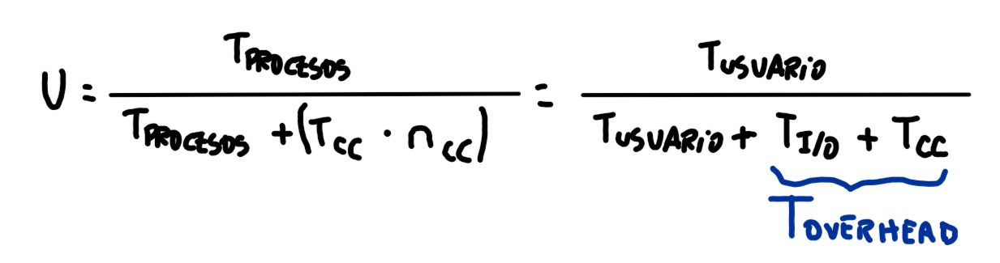
> donde $n$ corresponde a la cantidad de cambios de contexto, y tomando —por conveniencia— el tiempo asociado a un cambio de contexto como $0.2$, al planificarlos con los algoritmos descritos previamente, se obtienen los siguientes resultados:
> 
> <b><u>FCFS/FIFO</u></b>:
> 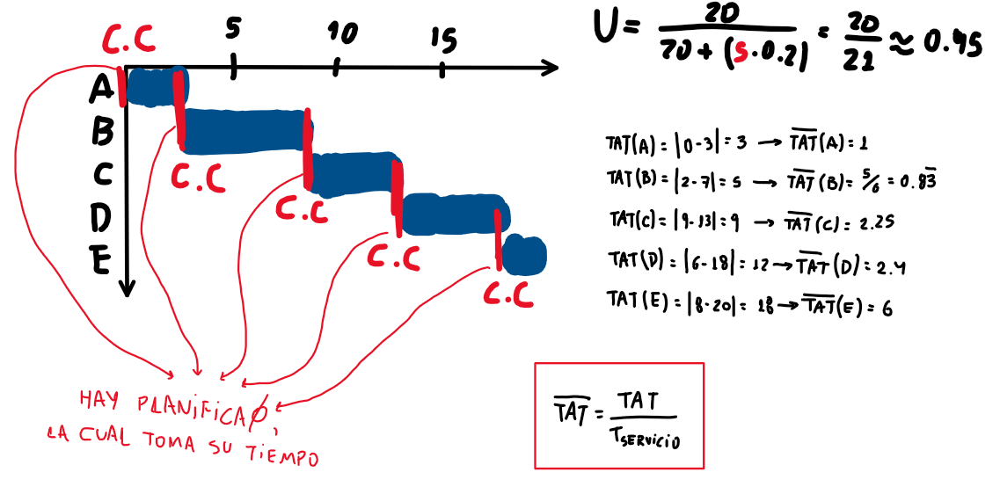
> <b><u>RR, con q=1</b></u>:
> 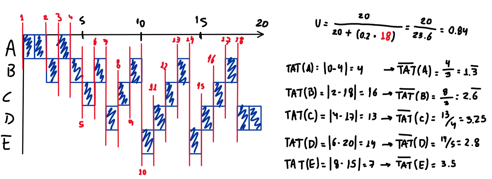
><b><u>SPN</b></u>:
> 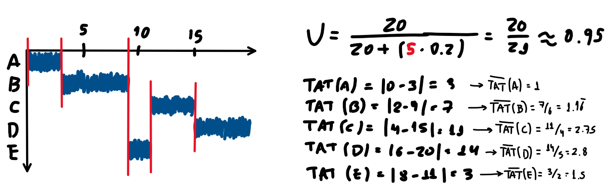
><b><u>SRT</b></u>:
> 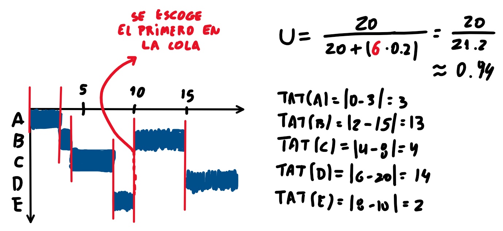
><b><u>HRRN</b></u>:
> 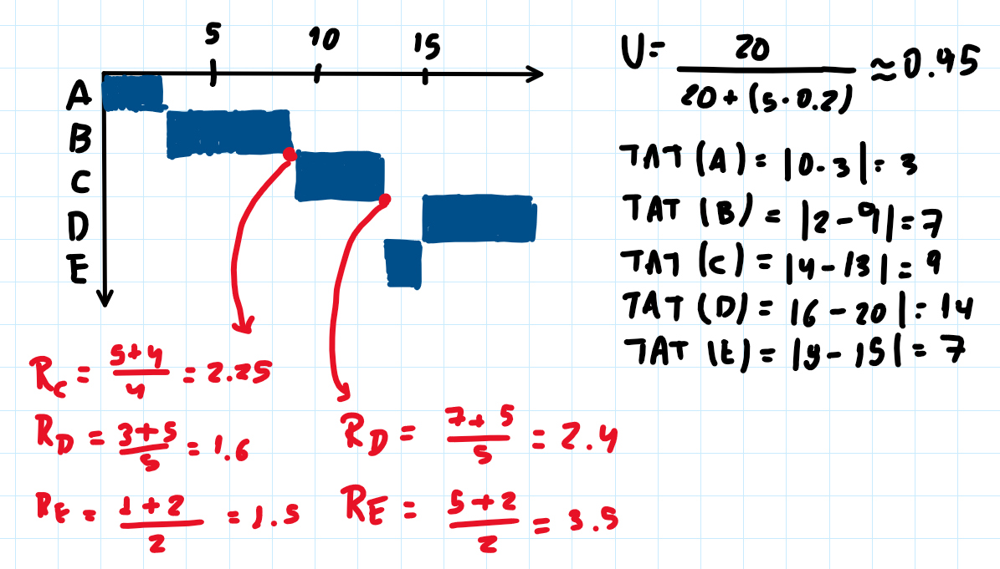

> [!ojo]
> De igual forma como la utilización puede también considerar el tiempo de *overhead* para su cálculo, lo mismo puede ocurrir con el *throughput*:
> $$\text{throughput} = \frac{\text{Cantidad de proecesos}}{\text{Tiempo total (incluye overhead)}}$$

> [!observacion] ¿Cómo el sistema operativo sabe cuando hay que desapropiar?
> > [!definicion] *system timer* (*software*)
> > Es el encargado de interrumpir al procesador con una determinada frecuencia, donde cada interrupción recibe el nombre de "*tick*"
> > 
> > Por ejemplo, un *timer* hace 1000 interrupciones/*ticks* por segundo   ($HZ=1000$); o que es lo mismo que decir que realiza una interrupción/*tick* por milisegundo ($\frac{1}{HZ}$)
> > 
> > No confundir con la **frecuencia del procesador** (*hardware*), la que se mide en $[\frac{ciclos}{ticks}]$
> 
> > [!definicion] *jiffies*
> > Variable de *software* que contiene la cantidad de *ticks* ocurridos desde el inicio o *booteo* del sistema.
> > 
> > Es posible obtener el tiempo que el sistema "lleva arriba" como:$$\frac{jiffies}{HZ}[segundos]$$
> > 
> > De forma similar, es posible obtener el tiempo de operación de un proceso al comparar el tiempo del sistema cuando inicia su ejecución, con el tiempo cuando termina.
> 
> Cuando ocurre un *tick*, se interrumpe el procesador y se ejecuta un manejador de instrucciones, el cual:
> 
> * A nivel de *hardware*, guarda el tiempo actual e invoca a la rutina de *software* (propia de Linux) `do_timer()`
> * A nivel de *software*, `do_timer()` incrementa los *jiffies* en 1, actualiza los tiempos de uso del usuario y del sistema, ejecuta *timers* expirados, y ejecuta `scheduler_tick()`, que revisa si un proceso se debe desapropiar o no.
>   
>  Un ejemplo de un algoritmo de planificación desapropiativo:
>  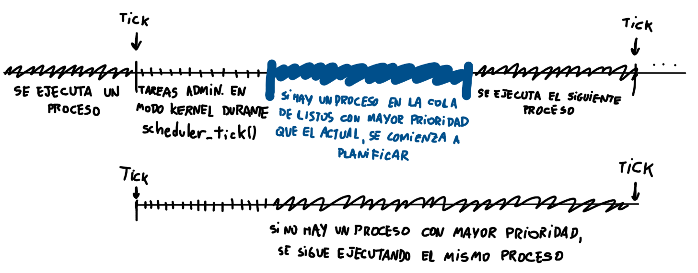
>  
>  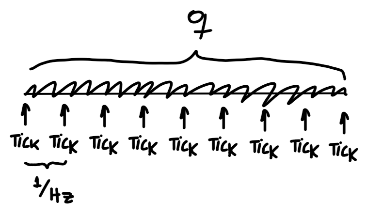
>  Para el caso de RR, por cada *tick* se va revisando si es que el proceso agotó su *quantum*.
>  
>  > [!ejemplo] Mini-ejemplo
>  > 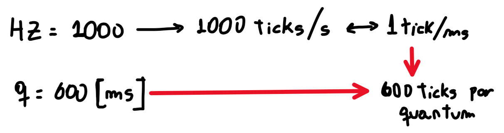

