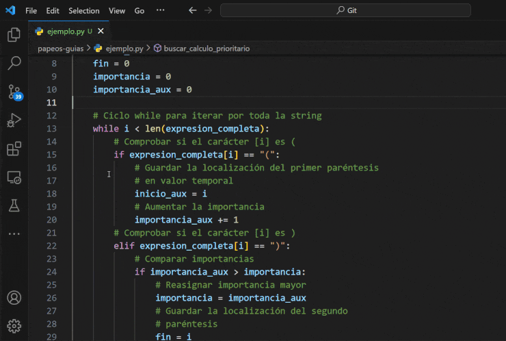

# Guia para escribir más rápido
> Escribe más, teclea menos

- [Porqué debería aprender a escribir más rápido?](#porqué-debería-aprender-a-escribir-más-rápido)
  - [Ejemplo rápido](#ejemplo-rápido)
- [Lo más simple](#lo-más-simple)
  - [Deshacer](#deshacer)
  - [Rehacer](#rehacer)
  - [Mover el cursor](#mover-el-cursor)
    - [Un caracter a la vez](#un-caracter-a-la-vez)
    - [Mover entre palabras](#mover-entre-palabras)
    - [Mover al inicio y final](#mover-al-inicio-y-final)
  - [Selecciones](#selecciones)
    - [Selección multiple](#selección-multiple)
    - [Selección en bloque](#selección-en-bloque)
    - [Mover y duplicar selección](#mover-y-duplicar-selección)
- [VSCode](#vscode)
  - [Extensión](#extensión)
  - [Agregar indentación](#agregar-indentación)
  - [Find y Replace](#find-y-replace)
  - [Find in selection](#find-in-selection)
  - [Rename Symbol](#rename-symbol)
  - [Change all ocurrences](#change-all-ocurrences)
  - [Duplicar lineas](#duplicar-lineas)
  - [Mover lineas](#mover-lineas)
  - [Go to definition](#go-to-definition)
  - [Comentar selección](#comentar-selección)
  - [IntelliSense y Sugerencias](#intellisense-y-sugerencias)
- [Paleta de comandos](#paleta-de-comandos)
- [Más allá](#más-allá)

# Porqué debería aprender a escribir más rápido?

Tu objetivo es maximizar el tiempo que pasas trabajando en tu problema, cuando te detienes a pelear con tu IDE, dejas de darle atención al problema en cuestión.

La motivación detrás de los atajos de teclado, es *evitar sacar las manos del teclado*.

## Ejemplo rápido

Quiero usar una pep de python para tener código para modificar, pero el programa está lleno de comentarios y quiero borrarlos, podría ir linea a linea borrando cada uno, o podría hacer esto:

</img>

# Lo más simple

Funcionalidades presentes en todos los editores de texto

## Deshacer

`ctrl + z`

## Rehacer

`ctrl + y` o `ctrl + shift + z`

## Mover el cursor

### Un caracter a la vez

Movimiento básico que todos conocemos usando las flechas

###  Mover entre palabras

Añadiendo `ctrl` al movimiento de las flechas horizontales moverá el cursor al inicio y final de las palabras.

`ctrl + backspace` borrará la palabra completa.

</img>

### Mover al inicio y final

Las teclas `home` y `end` moverán el cursor al inicio y final de la linea

## Selecciones

### Selección multiple

Mantener `alt` y hacer click agregará más selecciones para añadir o eliminar en múltiples instancias a la vez

### Selección en bloque

Mantener `shift + alt` al mover las flechas te permitirá seleccionar en bloque
También puedes mantener el botón de la rueda del mouse

### Mover y duplicar selección

Arrastrar una selección moverá la selección de un punto a otro.
Al agregar `ctrl`, se duplicará la selección en el lugar indicado.

# VSCode
## Extensión
[Notepad++ keymap](https://marketplace.visualstudio.com/items?itemName=ms-vscode.notepadplusplus-keybindings)
Permite usar atajos de teclado más intuitivos, en mi opinión.

## Agregar indentación
Agregar `ctrl + [`

Eliminar `ctrl + ]`

Alternativamente puedes usar `tab` y `shift + tab` respectivamente.

</img>

## Find y Replace

`ctrl + f` abre el menú `find`, que permite elegir entre varias opciones de búsqueda, y también puedes reemplazar el texto encontrado uno a uno o todos a la vez.

</img>

## Find in selection

Puedes buscar en una selección específica.

</img>

## Rename Symbol

Cambiará el nombre de una variable **inteligentemente**, a lo largo de **todos los archivos del proyecto**

## Change all ocurrences

`Change all ocurrences` te dará un cursor en cada instancia de la selección del archivo.

</img>

## Duplicar lineas

Recomiendo cambiar `Duplicate Selection` a `ctrl + d`

Usar el comando sin seleccionar nada, duplicará toda la linea actual

## Mover lineas

Puedes mantener `alt` y usar las flechas verticales para mover líneas enteras

Tamién sirve con selecciones

</img>

## Go to definition

Hacer `ctrl + mouse1` en un elemento te mostrará sus definiciones

</img>

## Comentar selección

Por defecto `ctrl + k ctrl + c` transformará la selección a un comentario y `ctrl + k ctrl + u` eliminará el comentario.

Con la extensión `ctrl + k` y `ctrl + shift + k` respectivamente.

</img>

## IntelliSense y Sugerencias

`ctrl + space` abrirá el menú de sugerencias

`ctrl + i` abrirá el menú de sugerencias en la palabra actual

# Paleta de comandos

Si no recuerdas como usar un comando, puedes abrir la paleta de comandos, que te dará una lista de todos los comandos disponibles, y sus respectivos atajos.

`ctrl + shift + p` abrirá la paleta de comandos

`ctrl + p` abrirá el buscador de archivos, puedes agregar el `>` y el buscador se transformará en la paleta de comandos

# Más allá

El siguiente paso es *no sacar las manos del centro del teclado* es [Neovim](https://neovim.io/). No recomendado.

O [vim motions](https://marketplace.visualstudio.com/items?itemName=vscodevim.vim), si no puedes soportar el poder de neovim. 

